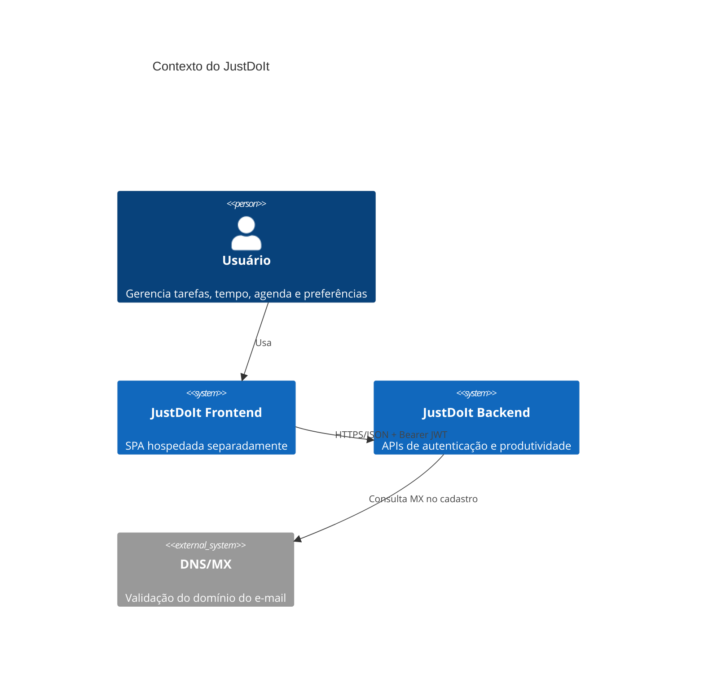
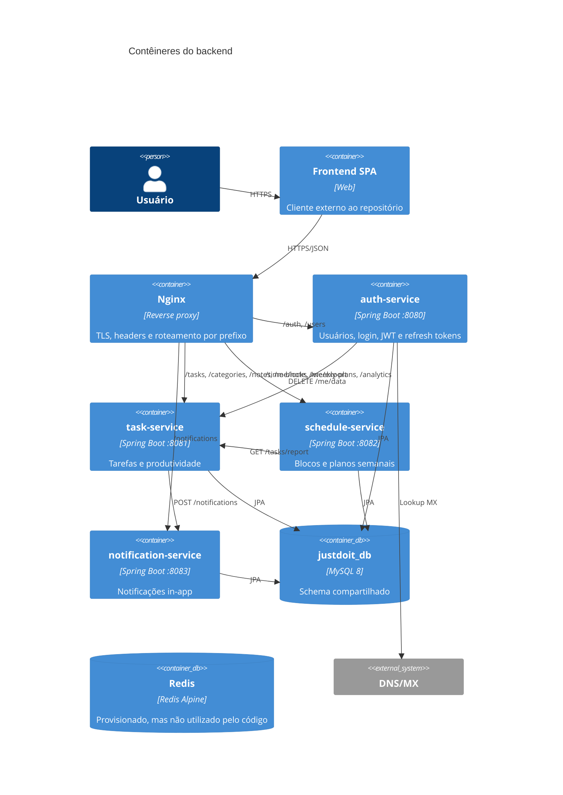
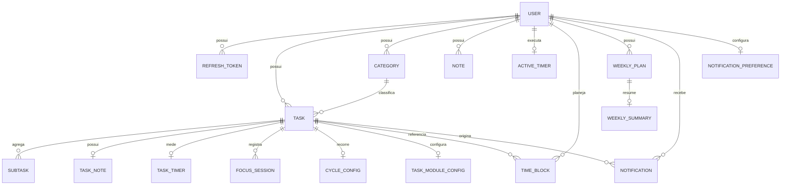
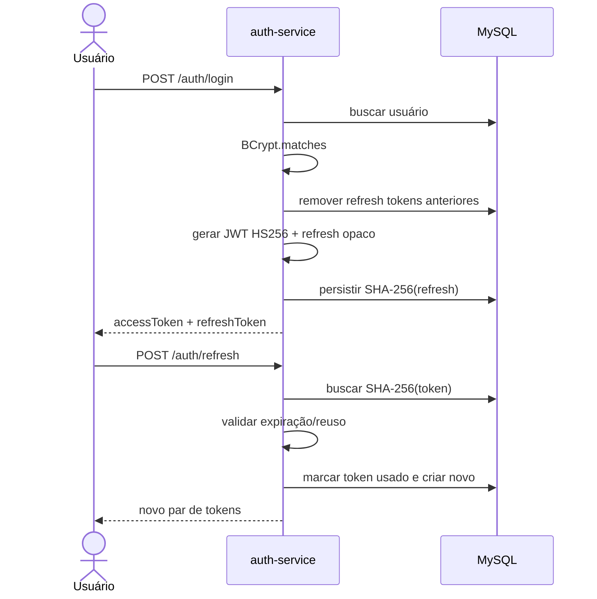
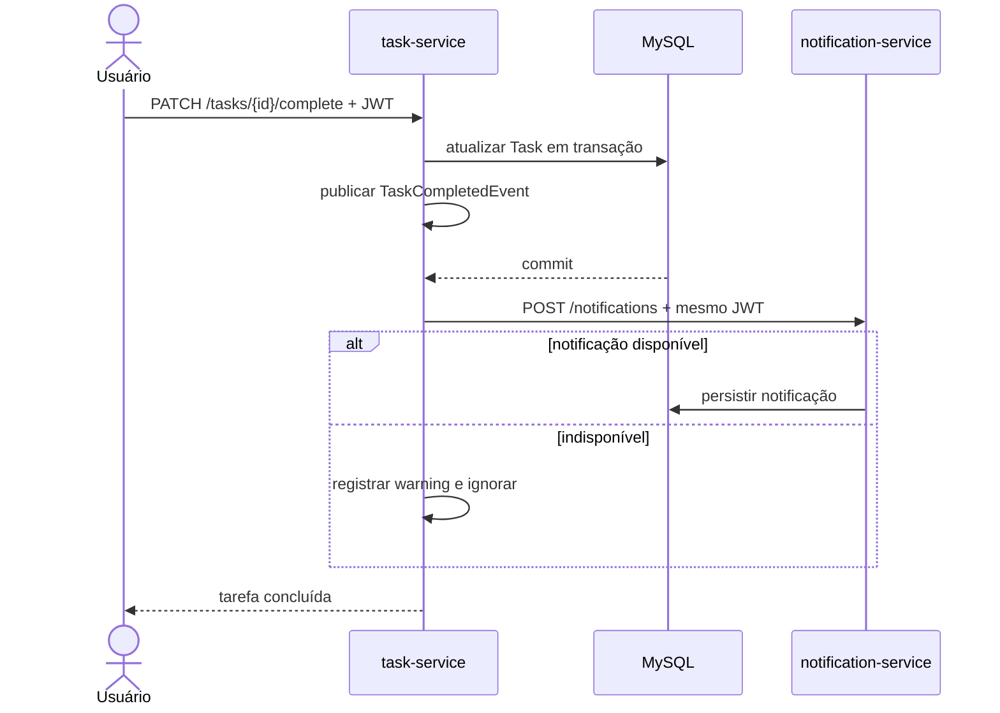
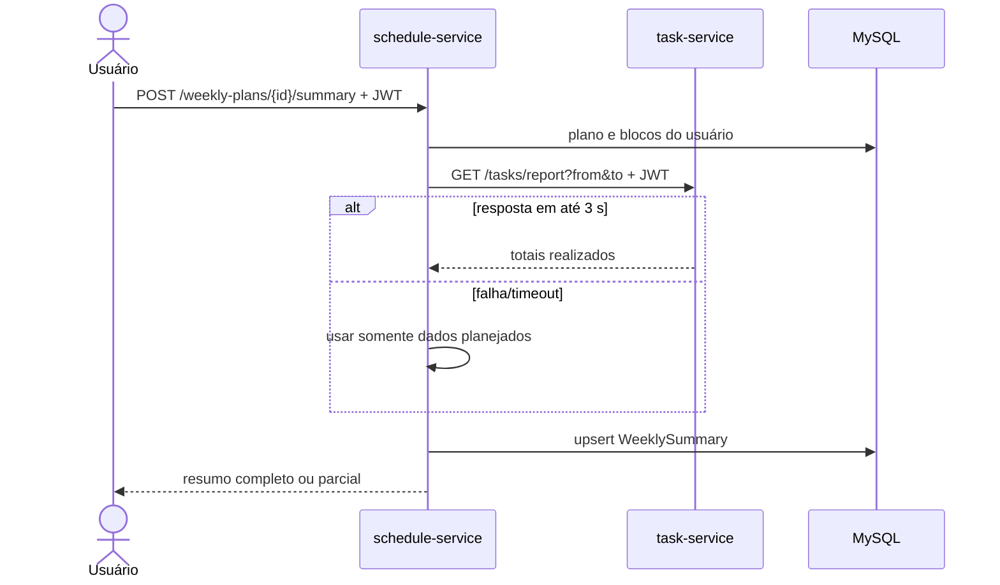
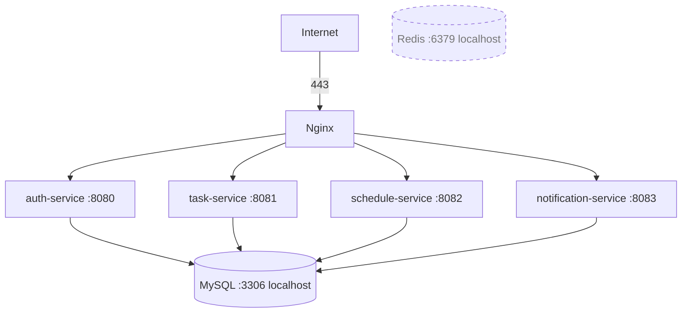
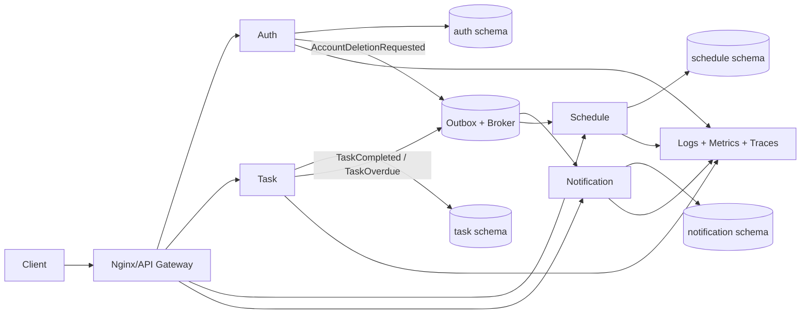

# Projeto Arquitetural — JustDoIt Backend

> Documento de arquitetura do estado implementado, elaborado por inspeção do código-fonte em 30/07/2026. Onde a documentação e o código divergem, este documento considera o código como fonte de verdade.

## 1. Resumo executivo

O JustDoIt é um backend de produtividade pessoal organizado como monorepo Java 21/Spring Boot 3.4.1. A solução executa quatro aplicações independentes — autenticação, tarefas, agenda e notificações — atrás de um reverse proxy Nginx. Os módulos compartilham uma biblioteca de segurança e o mesmo banco MySQL.

A arquitetura é melhor descrita, no estado atual, como **microsserviços de implantação independente com persistência compartilhada**. Existem limites funcionais e processos separados, mas ainda não há autonomia completa de dados, mensageria, service discovery ou plataforma de observabilidade. Internamente, os serviços seguem uma arquitetura em camadas, organizada por feature:

```text
HTTP Controller → Application/Domain Service → Spring Data Repository → MySQL
                         ↓
               Integration Client / Event Listener
```

O `task-service` concentra a maior parte do domínio e funciona como núcleo do produto. `auth-service` é o único emissor de JWT. `schedule-service` compõe dados próprios com relatórios do `task-service`. `notification-service` mantém alertas in-app e preferências.

### Avaliação sintética

| Aspecto | Estado atual |
|---|---|
| Modularidade | Boa separação por serviço e por feature |
| Segurança | JWT stateless, BCrypt, refresh tokens opacos com hash e rotação |
| Isolamento multiusuário | Aplicado nas consultas de negócio por `userId` |
| Consistência | Transações locais; coordenação distribuída parcial e síncrona |
| Resiliência | Timeouts e best-effort em duas integrações; incompleta na exclusão de conta |
| Escalabilidade | Serviços escaláveis separadamente, mas jobs e rate limit pressupõem instância única |
| Evolução do banco | Flyway por domínio e Hibernate `validate`; schema físico ainda compartilhado |
| Observabilidade | Apenas logs; sem Actuator, métricas, tracing ou correlação |
| Entrega | JARs com systemd e Nginx; não há pipeline de CI/CD no repositório |

## 2. Escopo e método da análise

Foram inspecionados:

- arquivos Gradle e os cinco módulos do monorepo;
- 143 classes Java de produção, aproximadamente 5.100 linhas;
- controllers, services, entidades, repositories, DTOs e configurações;
- testes unitários, slices MVC, integrações H2 e testes de métricas;
- configurações Spring, Docker Compose, Nginx e units systemd;
- histórico Git recente e README.

Artefatos gerados (`build/`) não foram tratados como fonte arquitetural. Não há `AGENTS.md`, especificação OpenAPI, Dockerfiles ou workflows de CI versionados.

## 3. Contexto do sistema

### 3.1 Atores e sistemas externos



### 3.2 Objetivos arquiteturais inferidos

- separar autenticação do domínio de produtividade;
- permitir evolução funcional por módulos;
- manter APIs stateless e um frontend desacoplado;
- garantir que um usuário só acesse seus próprios recursos;
- suportar tarefas recorrentes, time-blocking e medição de foco;
- degradar funcionalidades auxiliares sem interromper operações principais.

## 4. Visão de contêineres



### 4.1 Responsabilidades e dependências

| Contêiner | Responsabilidades | Dados que governa logicamente | Dependências |
|---|---|---|---|
| `auth-service` | cadastro, login, perfil, logout, refresh e exclusão da conta | `users`, `refresh_token` | MySQL, DNS/MX, task-service |
| `task-service` | tarefas, subtarefas, categorias, notas, ciclos, foco, timers, exportação e relatórios | 10 tabelas do domínio de tarefas | MySQL, notification-service |
| `schedule-service` | blocos de tempo, plano e resumo semanal | `time_block`, `weekly_plan`, `weekly_summary` | MySQL, task-service |
| `notification-service` | caixa de notificações e preferências | `notification`, `notification_preference` | MySQL |
| `libs/common` | filtro/validador JWT, validação de texto e erro de Bean Validation | não persiste | incorporada nos quatro JARs |

## 5. Organização interna

Cada aplicação usa component scan para seu pacote e `com.justdoit.common`. O padrão predominante é:

- `feature/<feature>`: controller, service, entidade e repository próximos;
- `shared`: records de request/response e enums;
- `integration`: clientes HTTP e listeners;
- `config`: Spring Security e configurações transversais.

Não existem interfaces de porta entre application services e JPA; portanto, apesar da boa organização por feature, o desenho é uma arquitetura em camadas pragmática, não uma implementação estrita de Clean/Hexagonal Architecture.

### 5.1 auth-service

Componentes principais:

- `AuthController`: API pública e perfil autenticado;
- `AuthService`: casos de uso e transações;
- `JwtUtil`: emissão HS256;
- `JwtValidator`/`JwtAuthFilter`: validação compartilhada;
- `MxEmailVerifier`: consulta de domínio;
- `RateLimitFilter`: token bucket por IP em memória;
- `TaskServiceClient`: purga síncrona dos dados de tarefas;
- `RefreshTokenCleanupJob`: limpeza diária às 03:00.

Decisões relevantes:

- access token de 15 minutos, stateless;
- refresh token aleatório de 256 bits; somente SHA-256 é persistido;
- sessões curtas de 12 horas ou “lembrar-me” de 30 dias;
- rotação com tolerância de 30 segundos e detecção de reuso;
- novo login revoga refresh tokens anteriores, limitando a uma sessão renovável;
- BCrypt para senhas e hash sacrificial para reduzir enumeração por timing;
- rate limit de login/cadastro/check-email: 20 requisições de rajada e 20/minuto por IP.

### 5.2 task-service

O serviço é dividido em:

- `task`: aggregate `Task`, subtarefas e estados;
- `category`: classificação visual por usuário;
- `tasknote`: uma nota 1:1 vinculada à tarefa;
- `note`: várias anotações livres e uma compatibilidade de nota fixada;
- `timer`: tempo estimado/real e cronômetro ativo;
- `focussession`: sessões Pomodoro/foco;
- `cycle`: regras e materialização de recorrências;
- `moduleconfig`: habilitação de módulos por tarefa;
- `report`: agregações por período e categoria;
- `export`: JSON/CSV;
- `userdata`: exclusão em cascata dos dados do usuário.

`Task` é o aggregate root no modelo JPA. Relações dependentes usam cascata e carregamento lazy. O isolamento é feito consultando tarefa/categoria pelo par `(id, userId)` antes de manipular recursos filhos.

Jobs:

- `OverdueTaskJob`: a cada hora, no minuto 15, marca tarefas vencidas;
- `CycleInstanceJob`: diariamente às 00:30, materializa ocorrências recorrentes.

Concorrência:

- `active_timer.user_id` é único;
- a restrição do banco arbitra corridas e garante um cronômetro ativo por usuário;
- o segundo acionamento é convertido em conflito HTTP 409.

### 5.3 schedule-service

É uma única feature coesa:

- CRUD de blocos de tempo;
- abertura e fechamento de plano semanal;
- resumo persistido de estimativa versus execução.

Ao gerar um resumo, soma as estimativas locais e solicita ao `task-service` as tarefas concluídas e segundos realizados. A chamada tem timeout de conexão de 2 s e leitura de 3 s. Em falha, salva um resumo parcial com dados locais.

O método `overlaps` detecta sobreposição, mas não é usado na criação ou atualização; blocos conflitantes são atualmente aceitos.

### 5.4 notification-service

Mantém notificações in-app e três preferências booleanas: conclusão, atraso e reinício de ciclo. A criação autenticada usa o `userId` do JWT, impedindo o cliente de escolher outro destinatário.

Não há entrega por e-mail, push, WebSocket/SSE, retenção ou paginação. A listagem retorna todo o histórico do usuário.

## 6. Modelo de dados

Há 17 entidades em um único schema. UUIDs são usados como identificadores.



As relações entre serviços, desenhadas acima para compreensão, são **referências lógicas por UUID**, não foreign keys JPA. `user_id` é replicado nas tabelas de cada domínio. `time_block.task_id` e `notification.task_id` também são referências fracas.

### 6.1 Donos lógicos das tabelas

| Serviço | Tabelas |
|---|---|
| auth | `users`, `refresh_token` |
| task | `task`, `subtask`, `category`, `task_note`, `note`, `task_timer`, `active_timer`, `focus_session`, `cycle_config`, `task_module_config` |
| schedule | `time_block`, `weekly_plan`, `weekly_summary` |
| notification | `notification`, `notification_preference` |

### 6.2 Integridade e índices

Restrições importantes:

- e-mail de usuário único;
- hash do refresh token único;
- uma configuração, timer e nota de tarefa por `task_id`;
- um resumo por plano semanal;
- um cronômetro ativo e uma preferência por usuário;
- baselines novos já declaram índices alinhados às principais consultas em instalações novas.

Os índices dos baselines cobrem tarefas por usuário/status/prazo, blocos por
usuário/data, notificações por usuário/leitura/data, sessões por tarefa/data e
ocorrências por série/data. Como `CREATE TABLE IF NOT EXISTS` não modifica
tabelas legadas, esses índices devem ser conferidos no banco já existente e,
quando ausentes, adicionados por uma migration posterior específica.

## 7. Contratos HTTP

Todos os endpoints, salvo os quatro públicos do auth, exigem `Authorization: Bearer <access-token>`.

### 7.1 Autenticação e perfil

| Método e rota | Função |
|---|---|
| `POST /auth/register` | cria usuário e tokens |
| `GET /auth/check-email` | verifica cadastro e MX |
| `POST /auth/login` | autentica e emite tokens |
| `POST /auth/refresh` | rotaciona refresh token |
| `POST /auth/logout` | revoga sessões renováveis |
| `GET /auth/me` | consulta perfil |
| `PUT /auth/me` | altera perfil/senha/avatar |
| `DELETE /auth/me` | exclui conta e dados de tarefas |

### 7.2 Tarefas e produtividade

- `/tasks`: CRUD, concluir/reabrir, subtarefas e progresso;
- `/categories`: CRUD por usuário;
- `/tasks/{id}/note`: nota única da tarefa;
- `/notes`: CRUD de anotações livres e pin;
- `/me/note`: fachada de compatibilidade para a nota fixada;
- `/tasks/{id}/timer`: configuração, lançamento, start e stop;
- `/timers/active`: cronômetro atual;
- `/tasks/{id}/focus-sessions`: CRUD de sessões;
- `/tasks/{id}/cycle-config`: configuração de recorrência;
- `/tasks/{id}/module-config`: flags dos módulos;
- `/tasks/report`: relatório por período;
- `/analytics/categories`: agregado por categoria;
- `/me/export?format=CSV|JSON`: portabilidade;
- `DELETE /me/data`: purga interna, não exposta no Nginx.

### 7.3 Agenda

- `POST/GET/PUT/DELETE /time-blocks`;
- `POST /weekly-plans`;
- `PATCH /weekly-plans/{id}/close`;
- `POST/GET /weekly-plans/{id}/summary`.

O Nginx também encaminha `/events` e `/analytics` ao schedule-service, mas não há controllers correspondentes no código atual.

### 7.4 Notificações

- `POST/GET /notifications`;
- `GET /notifications/unread`;
- `PATCH /notifications/{id}/read`;
- `GET/PUT /notifications/preferences`.

Não há versionamento de API (`/v1`) nem contrato OpenAPI.

## 8. Fluxos críticos

### 8.1 Login e renovação



O access token antigo continua válido até expirar; logout não implementa blacklist.

### 8.2 Conclusão com notificação



O listener roda `AFTER_COMMIT`, evitando notificação de uma transação revertida. Porém, por ser chamada best-effort sem outbox/retry, uma falha causa perda definitiva da notificação.

### 8.3 Resumo semanal



O contrato não informa ao cliente se o resumo foi degradado.

### 8.4 Exclusão de conta

`auth-service` chama síncronamente `DELETE /me/data`, depois apaga refresh tokens e usuário. A chamada remota ocorre dentro de uma transação local do auth. Não existe transação distribuída:

- se o task-service falhar, a conta não é apagada;
- se a purga remota concluir e a transação auth falhar depois, dados de tarefas já terão sido apagados;
- dados no schedule-service e notification-service não são removidos;
- o cliente HTTP não configura timeout explícito.

## 9. Segurança

### 9.1 Implementação atual

- JWT HS256 com `iss`, `aud`, `type=access`, `sub`, `email`, `profile`, `iat`, `exp` e `jti`;
- mesmo segredo HMAC injetado nos quatro serviços;
- principal do Spring Security é um UUID sem authorities;
- política stateless, CSRF/basic/form login desabilitados;
- CORS por lista de origens, credentials habilitadas;
- TLS e headers de segurança no Nginx;
- Bean Validation e `@TextoSeguro` para rejeitar padrões de HTML/script;
- ownership aplicado nos services;
- rate limit local para endpoints públicos mais sensíveis.

### 9.2 Limitações

- segredo simétrico compartilhado amplia o impacto de vazamento;
- não há rotação de chaves, `kid`, JWKS ou assimetria;
- o claim `profile` não vira authority e não existe autorização por papel;
- refresh token aparentemente transita no body, não em cookie HttpOnly;
- mensagens de erro são tratadas de formas diferentes nos controllers;
- `show-sql=true` em runtime pode vazar dados e elevar custo;
- confiança em `X-Forwarded-For` depende de impedir acesso direto ao serviço;
- endpoint de consulta de e-mail revela explicitamente se uma conta existe;
- ausência de auditoria de ações sensíveis.

## 10. Persistência e consistência

Cada caso de uso usa transações Spring locais. A opção `open-in-view=false` é
positiva: o acesso lazy deve ocorrer dentro da camada de serviço. O Flyway é o
único responsável pelo DDL; depois das migrations, o Hibernate executa
`ddl-auto=validate` e falha cedo se entidades e schema divergirem.

Cada serviço possui um baseline `V1` e uma tabela de histórico independente
(`flyway_auth_history`, `flyway_task_history`, `flyway_schedule_history` e
`flyway_notification_history`). `baseline-version=0` permite que uma instalação
legada, ainda sem histórico, execute o `V1`; os comandos `CREATE TABLE IF NOT
EXISTS` preservam as tabelas e dados existentes. Os testes H2 atuais mantêm
`create-drop` e desabilitam Flyway, enquanto uma validação futura com
Testcontainers deve executar as migrations em MySQL real.

### 10.1 Primeiro deploy sobre o banco legado

O primeiro deploy com Flyway deve ser controlado:

1. criar e testar um backup do `justdoit_db`;
2. comparar `SHOW CREATE TABLE` das 17 tabelas com os quatro baselines `V1`;
3. iniciar uma única instância de cada serviço, na ordem auth, task, schedule e notification;
4. confirmar as quatro tabelas `flyway_*_history` e o registro de `V1`;
5. confirmar que o Hibernate concluiu `validate` sem divergências;
6. executar smoke tests antes de liberar o tráfego.

Se uma tabela legada existir com estrutura divergente, `CREATE TABLE IF NOT
EXISTS` a preserva e o `validate` interrompe o startup. A correção deve ser uma
nova migration revisada; não se deve voltar temporariamente a
`ddl-auto=update`.

Consequências do banco compartilhado:

- uma migration incorreta ainda pode alcançar o mesmo schema físico;
- credenciais concedem acesso técnico a dados de todos os domínios;
- falha ou contenção do banco afeta toda a plataforma;
- versões de migrations são independentes por serviço, sem uma ordem global entre domínios;
- os limites de serviço são convencionais, não garantidos pela infraestrutura.

Para a escala atual, isso reduz custo operacional. Para evolução segura, o primeiro passo não precisa ser um banco físico por serviço: schemas/usuários separados e migrations por dono já criam limites verificáveis.

## 11. Resiliência, desempenho e escalabilidade

### 11.1 Práticas existentes

- chamadas schedule→task e task→notification têm timeouts curtos;
- integrações auxiliares degradam em best-effort;
- unicidade no banco resolve a corrida do cronômetro;
- consultas de exportação usam `join fetch`;
- refresh tokens expirados são limpos periodicamente.

### 11.2 Pontos de atenção

- jobs duplicam execução com mais de uma réplica; falta lock distribuído;
- rate limit é por processo, portanto a capacidade multiplica por réplica;
- Redis é provisionado, mas não participa de nenhuma dessas funções;
- listas de tarefas, notas e notificações não são paginadas;
- poucos índices explícitos para os filtros mais usados;
- geração de CSV/JSON e relatórios ocorre de forma síncrona;
- HTTP remoto dentro de transação mantém conexão de banco ocupada;
- não há circuit breaker, retry controlado ou bulkhead;
- não há cache e não foram definidos SLOs/capacidade.

## 12. Operação e implantação

### 12.1 Topologia implementada

- MySQL 8 e Redis via Docker Compose, publicados somente em `127.0.0.1`;
- quatro JARs em `/opt/justdoit`, cada um gerenciado por systemd;
- Nginx termina TLS, adiciona headers e encaminha por path;
- secrets e URLs vêm de `/opt/justdoit/.env`;
- frontend hospedado separadamente.



Não há health check do systemd, endpoint Actuator, readiness/liveness, log estruturado, rotação documentada, backup/restore, pipeline de deploy ou definição de rollback.

## 13. Estratégia de testes

O Gradle aplica JUnit 5 e JaCoCo a todos os módulos e gera relatórios HTML/XML após os testes.

Tipos encontrados:

- testes unitários de services e validações;
- slices MVC com MockMvc e autenticação simulada;
- integração com H2 em modo MySQL para auth, exportação e relatórios;
- testes de concorrência real para cronômetro ativo;
- testes de qualidade/métricas para validação maliciosa e acesso indevido.

Limitações:

- H2 não reproduz integralmente MySQL, locking e DDL;
- não há Testcontainers nem testes de contrato entre serviços;
- não há teste end-to-end dos quatro processos com Nginx;
- não há teste da configuração systemd/produção;
- alguns contratos descritos no README não têm implementação, sem teste que detecte a divergência.

### 13.1 Resultado da validação nesta análise

O comando `gradlew.bat test` foi executado em 30/07/2026. O wrapper Gradle 9.5.1 foi obtido corretamente, mas nenhuma suíte chegou a iniciar: o build falhou na resolução da toolchain porque o ambiente analisado não possui JDK 21 e o projeto não configura repositório para provisionamento automático de toolchains. Portanto, a existência e a estrutura dos testes foram verificadas por inspeção, mas seu resultado não deve ser presumido como verde.

## 14. Achados e riscos priorizados

| Prioridade | Achado | Impacto | Recomendação |
|---|---|---|---|
| Crítica | `POST /internal/notifications` é chamado pelo job de atraso, mas não existe no notification-service | notificações de atraso nunca são criadas | implementar endpoint autenticado entre serviços ou adotar outbox/eventos |
| Crítica | exclusão da conta não apaga agenda nem notificações | retenção indevida de dados pessoais | orquestrar purga idempotente em todos os donos de dados |
| Alta | banco e credencial compartilhados | acoplamento, blast radius e acesso excessivo | schemas/usuários por serviço; separar bancos quando necessário |
| Alta | ausência de observabilidade/health | falhas e degradações ficam invisíveis | Actuator, Micrometer, logs JSON, correlation ID e alertas |
| Alta | jobs não coordenados entre réplicas | duplicidade e corrida ao escalar | ShedLock/Redis/DB ou scheduler externo |
| Alta | deleção distribuída síncrona não atômica | estados parciais | saga/orquestração com tombstone, retry e auditoria |
| Média | ausência de paginação | memória/latência crescentes | `Pageable` e limites máximos |
| Média | contratos HTTP não versionados/documentados | quebra acidental de consumidores | OpenAPI e testes de contrato |
| Média | resposta de resumo não marca dado parcial | UI pode apresentar número degradado como completo | campo `dataStatus`/`generatedAt` |
| Média | sobreposição de time blocks não é aplicada | agenda aceita conflitos possivelmente inválidos | validar regra ou remover método morto/documentar permissão |
| Média | rate limit em memória e Redis ocioso | proteção inconsistente com réplicas | mover bucket ao Redis ou Nginx |
| Média | ausência de timeout em auth→task | exclusão pode ficar presa | timeout, circuit breaker e idempotência |
| Média | índices do baseline não são aplicados a tabelas legadas já existentes | degradação progressiva de consultas | auditar `information_schema` e criar `V2` apenas para índices ausentes |
| Baixa | Nginx roteia `/events` e rotas não existentes | superfície/confusão operacional | alinhar configuração e controllers |
| Baixa | respostas de erro heterogêneas | contrato difícil para o frontend | Problem Details RFC 9457 centralizado |

## 15. Arquitetura-alvo incremental

A recomendação é preservar os quatro limites funcionais, mas amadurecer a plataforma sem uma reescrita.



Princípios:

1. cada serviço é o único escritor do seu schema;
2. contratos HTTP/eventos são versionados e testados;
3. efeitos distribuídos são idempotentes e observáveis;
4. operações essenciais não dependem de chamadas auxiliares síncronas;
5. toda mudança de schema é uma migration revisável;
6. segurança interna usa identidade de workload ou tokens assimétricos de curta duração;
7. dados pessoais têm inventário, retenção e deleção verificável.

Mensageria só deve ser introduzida para fluxos que justificam consistência eventual e retry — notificações e exclusão distribuída são os primeiros candidatos. CRUD interativo pode permanecer HTTP.

## 16. Roadmap recomendado

### Fase 0 — corrigir integridade funcional

- corrigir o fluxo interno de notificação de atraso;
- incluir schedule e notification na exclusão de conta;
- adicionar timeouts ao `TaskServiceClient`;
- alinhar as rotas do Nginx ao código;
- padronizar erros e indicar resumos parciais.

### Fase 1 — tornar operação segura

- adicionar Spring Boot Actuator e probes;
- desligar SQL em produção e estruturar logs;
- propagar `X-Correlation-ID`;
- criar dashboards de latência, erros, pool JDBC e jobs;
- documentar backup, restore, secrets e rollback;
- criar CI com build, testes, JaCoCo e análise estática.

### Fase 2 — governar dados e contratos

- **concluído:** introduzir Flyway, baselines por domínio e Hibernate `validate`;
- auditar no banco legado os índices declarados pelo baseline;
- publicar OpenAPI por serviço;
- usar Testcontainers MySQL e testes de contrato;
- separar credenciais e schemas por dono;
- adicionar paginação e limites.

### Fase 3 — resiliência distribuída

- implementar outbox para eventos de tarefa;
- usar Redis já provisionado para lock de jobs/rate limiting, ou removê-lo;
- idempotency keys para consumidores;
- retries com backoff e dead-letter;
- orquestrar exclusão de conta como saga auditável.

### Fase 4 — escala e segurança avançada

- JWT assimétrico com rotação/JWKS;
- autenticação serviço-a-serviço;
- política de retenção de notificações;
- separar bancos físicos conforme carga, risco ou times;
- testes de carga e SLOs formais.

## 17. Decisões arquiteturais a registrar (ADRs)

| ADR sugerido | Decisão atual/proposta |
|---|---|
| ADR-001 | monorepo Gradle multi-módulo |
| ADR-002 | limites funcionais dos quatro serviços |
| ADR-003 | JWT stateless e refresh token opaco |
| ADR-004 | ownership lógico por `userId` |
| ADR-005 | evento pós-commit best-effort para conclusão |
| ADR-006 | consistência eventual/outbox para notificações |
| ADR-007 | migrations e schema por serviço |
| ADR-008 | estratégia de exclusão de dados pessoais |
| ADR-009 | coordenação de jobs em múltiplas réplicas |
| ADR-010 | política uniforme de erros e versionamento de API |

Cada ADR deve registrar contexto, opções, decisão, consequências e plano de reversão.

## 18. Glossário

- **Access token**: JWT curto usado em cada chamada autenticada.
- **Refresh token**: segredo opaco persistido somente como hash para renovar a sessão.
- **Aggregate root**: entidade que controla alterações de um conjunto consistente; aqui, `Task`.
- **Best-effort**: tentativa sem garantia de entrega posterior.
- **Outbox**: evento salvo na mesma transação do dado de negócio e publicado de forma assíncrona.
- **Saga**: coordenação de transações locais para concluir ou compensar um fluxo distribuído.
- **Ownership**: validação de que o recurso pertence ao `userId` autenticado.

## 19. Critérios de aceite arquiteturais sugeridos

- 100% das rotas protegidas rejeitam JWT inválido e acesso a recurso de outro usuário;
- exclusão de conta remove ou anonimiza dados dos quatro serviços de forma auditável;
- nenhuma alteração de produção depende de `ddl-auto=update`;
- jobs produzem no máximo um efeito lógico mesmo com múltiplas réplicas;
- falhas de dependências aparecem em métricas e não causam espera ilimitada;
- APIs de coleção são paginadas e possuem limite;
- toda integração possui timeout, contrato testado e política de falha explícita;
- restauração de backup é testada periodicamente;
- disponibilidade e latência têm SLOs definidos por jornada crítica.
