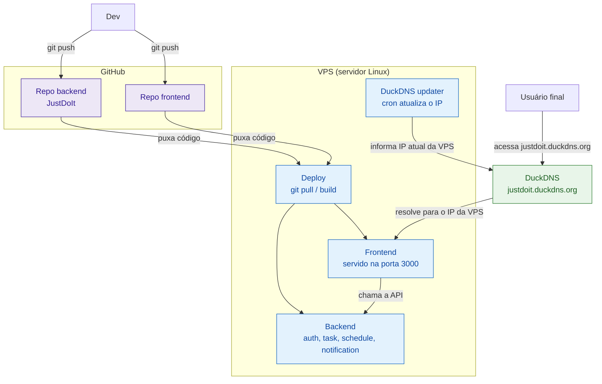

# Infraestrutura & Deploy

Fluxo entre os repositórios no GitHub, a VPS e o DuckDNS (DNS dinâmico).

```mermaid
flowchart TD
    dev["Dev"]
    user["Usuário final"]

    subgraph gh["GitHub"]
        repoBack["Repo backend<br/>JustDoIt"]
        repoFront["Repo frontend"]
    end

    subgraph vps["VPS (servidor Linux)"]
        deploy["Deploy<br/>git pull / build"]
        back["Backend<br/>auth, task, schedule, notification"]
        front["Frontend<br/>servido na porta 3000"]
        ducUpdater["DuckDNS updater<br/>cron atualiza o IP"]
    end

    duck["DuckDNS<br/>justdoit.duckdns.org"]

    dev -- "git push" --> repoBack
    dev -- "git push" --> repoFront

    repoBack -- "puxa código" --> deploy
    repoFront -- "puxa código" --> deploy
    deploy --> back
    deploy --> front

    ducUpdater -- "informa IP atual da VPS" --> duck

    user -- "acessa justdoit.duckdns.org" --> duck
    duck -- "resolve para o IP da VPS" --> front
    front -- "chama a API" --> back

    classDef src fill:#ede7f6,stroke:#4527a0,color:#311b92;
    classDef srv fill:#e3f2fd,stroke:#1565c0,color:#0d47a1;
    classDef net fill:#e8f5e9,stroke:#2e7d32,color:#1b5e20;
    class repoBack,repoFront src;
    class back,front,deploy,ducUpdater srv;
    class duck net;
```

