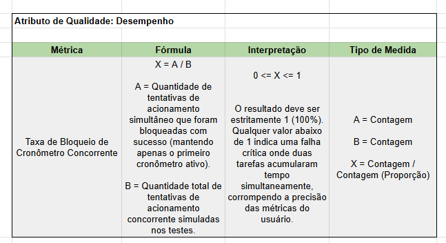

# Métricas de Qualidade — Observações de Implementação

> Atributos de qualidade avaliados: **Segurança** (métricas 1 e 2), **Desempenho** (métrica 3)
> e **Correção Funcional** (métrica 4)
> Última medição: 05/08/2026 — suíte com 331 testes, 0 falhas.

Cada métrica de atributo de qualidade é implementada como **teste executável**:
calcula o valor, imprime a medição e **falha** se a meta não for atingida. Não há
planilha manual nem verificação por inspeção — a evidência é o teste rodando.

## Convenção adotada

| Item | Regra |
|---|---|
| Localização | pacote `qualidade`, irmão de `feature`, em cada serviço |
| Nome da classe | sufixo `MetricsTest` |
| Javadoc | declara atributo, fórmula, significado de `A` e `B`, e o que um valor fora da meta representa |
| Saída | linha `[MÉTRICA <ATRIBUTO>] A=… / B=… -> X = …` |
| Asserção | dupla — lista de falhas vazia (com o motivo de cada uma) **e** `X` igual à meta |
| Acúmulo de falhas | em `List<String>`, sem abortar no primeiro erro, para que `A` e `B` sejam reais |

Uma classe **por serviço**, não por métrica global: como os testes disparam
requisições HTTP reais, cada um precisa subir o contexto do serviço dono das rotas.

Uma exceção consciente à convenção: `CronometroConcorrenteMetricsTest` **não** usa
`@Transactional`. A transação do teste é thread-local — as threads que disparam as
requisições simultâneas não enxergariam os dados, e o rollback não as alcançaria. Lá a
limpeza é manual, restrita aos dados que o próprio teste cria.

---

# Métrica 1 — Taxa de Bloqueio de Acesso Não Autorizado

| Campo | Valor |
|---|---|
| Fórmula | `X = A / B` |
| `A` | requisições com token ausente, inválido ou de outro usuário **corretamente rejeitadas** |
| `B` | total de requisições inválidas disparadas |
| Faixa / meta | `0 ≤ X ≤ 1`; ideal = **1** |
| Interpretação | valor abaixo de 1 indica brecha crítica na proteção das rotas, permitindo vazamento de dados |
| Classe | `auth-service/.../qualidade/AuthAccessControlMetricsTest` |

## O que o teste faz

Forja tokens JWT inválidos de oito formas distintas e dispara cada um contra todas
as rotas protegidas do serviço, contando quantas são bloqueadas (401 ou 403).

**Vetores testados** — header vazio, `Bearer` sem token, string que não é JWT, token
assinado com segredo errado, token expirado, esquema `Basic` no lugar de `Bearer`,
token válido sem o prefixo `Bearer`, e token com a assinatura adulterada no último
caractere. Somam-se as requisições sem nenhum header `Authorization`.

**Cálculo:** 4 requisições sem token + (8 headers inválidos × 4 rotas) = **36**.

Além da métrica, a classe traz dois testes de isolamento: o token de um usuário
devolve estritamente os dados do próprio dono, e um token forjado com a identidade
de outro usuário (assinatura inválida) é bloqueado.

## Resultado

```
[MÉTRICA SEGURANÇA] A=36 rejeitadas / B=36 inválidas -> X = 1,0000
```

## Alcance e limitação

O teste cobre **as 4 rotas protegidas do auth-service** (`GET/PUT/DELETE /auth/me`
e `POST /auth/logout`) — ou seja, 100% do serviço. As outras 4 rotas
(`/register`, `/login`, `/check-email`, `/refresh`) são públicas por projeto e
ficam fora corretamente.

**A medição não se estende aos demais serviços.** O sistema tem 61 rotas protegidas
no total; as 57 restantes (43 no task-service, 8 no schedule, 6 no notification)
não entram neste denominador. O valor `X = 1,0` deve ser lido como
*"do auth-service"*, não do sistema inteiro.

---

# Métrica 2 — Taxa de Eficácia de Filtragem e Validação de Entrada de Texto

| Campo | Valor |
|---|---|
| Fórmula | `X = A / B` |
| `A` | requisições com texto malicioso **rejeitadas** com sucesso (HTTP 400, nada persistido) |
| `B` | total de requisições com texto malicioso disparadas |
| Faixa / meta | `0 ≤ X ≤ 1`; ideal = **1** |
| Interpretação | valor abaixo de 1 indica que código malicioso burlou a proteção, violando Zero Trust e sendo salvo no sistema |
| Classes | `ValidacaoEntradaMetricsTest` no pacote `qualidade` do task, auth e notification |

## Diagnóstico inicial

Antes de medir, verificou-se o estado real da proteção:

| Verificação | Resultado |
|---|---|
| Busca por `sanitiz\|escape\|Jsoup\|HtmlUtils\|OWASP` no repositório | **zero ocorrências** |
| Validação existente nas DTOs | apenas `@NotBlank` e `@Size` — checam preenchimento e tamanho, não conteúdo |
| Query nativa com concatenação (`nativeQuery`, `createQuery`) | **zero ocorrências** |

Conclusão: **não havia filtragem de conteúdo alguma.** Um `<script>alert(1)</script>`
enviado como título de tarefa era persistido e devolvido literalmente. Medida naquele
momento, a métrica daria próximo de 0.

Ponto já favorável: **SQL Injection era estruturalmente impossível**, pois todo
acesso a dados usa Spring Data parametrizado.

## O que foi implementado

Como a métrica exige `X = 1`, a proteção ausente foi implementada junto com o teste.

**Mecanismo:** constraint de Bean Validation `@TextoSeguro` + `TextoSeguroValidator`,
em `libs/common/validation/`, compartilhada pelos quatro serviços. A escolha reaproveita
o que o projeto já usa — `@Valid` nos controllers e `GlobalExceptionHandler` convertendo
violação em HTTP 400 — sem introduzir biblioteca externa.

**Tática: rejeitar, não sanitizar.** Sanitizar silenciosamente alteraria o conteúdo
sem o usuário perceber; o 400 é explícito. Alinhado à política de Zero Trust.

**Padrões detectados:** abertura de tag HTML; handlers de evento inline
(`onerror`, `onload`, …); URIs executáveis (`javascript:`, `data:text/html`);
injeção de expressão (`${…}`, `#{…}`); comandos SQL; tautologia SQL (`1' OR '1'='1`);
byte nulo.

A lista é **específica em vez de genérica**, para não gerar falso positivo em texto
legítimo em português. Permanecem permitidos: apóstrofo isolado (`D'Ávila`), `--`
isolado, `<` seguido de espaço ou número (`orçamento < 500`), `&`, `%`, `+`.

**Aplicação:** 14 campos em 10 DTOs. Excluídos de propósito:

| Campo | Motivo |
|---|---|
| `password`, `newPassword`, `currentPassword` | senha legitimamente contém `<`, `'`, `;`; filtrar enfraqueceria a política de senhas |
| `refreshToken` | token opaco, formato próprio |
| `email` | já restringido por `@Email` |
| `CategoryRequest.color` | valor de cor (`#RRGGBB`), formato restrito |

**schedule-service não recebeu a anotação** porque não possui nenhum campo de texto
livre — `TimeBlockRequest` e `WeeklyPlanRequest` contêm apenas UUID, datas e inteiros.
É uma constatação, não uma omissão.

## Como o teste foi dividido

Doze payloads maliciosos (XSS, injeção de expressão e SQL) disparados contra cada
campo de texto livre, em três classes:

| Serviço | Campos medidos | Payloads | Requisições (B) | Rejeitadas (A) | X |
|---|---:|---:|---:|---:|---:|
| task-service | 7 | 12 | 84 | 84 | 1,0000 |
| auth-service | 3 | 12 | 36 | 36 | 1,0000 |
| notification-service | 2 | 12 | 24 | 24 | 1,0000 |
| **Total** | **12** | **12** | **144** | **144** | **1,0000** |

Subtarefa e nota-de-tarefa recebem a proteção mas ficam fora do denominador: exigem
uma tarefa preexistente, que por sua vez só é criável com título válido.

## Verificações complementares

**Não persistência (task-service).** Após a bateria, o teste consulta `GET /tasks` e
`GET /notes` e verifica que nenhum payload foi gravado — evidência direta do critério
*"não sendo salvo ou executado no sistema"* previsto na interpretação da métrica.

**Guarda contra falso positivo (todas as classes).** Um teste separado envia texto
legítimo em português e exige que continue sendo aceito:
`"Revisar orçamento < 500 reais"`, `"Reunião com D'Ávila às 14h"`,
`"Tarefa 1 -- prioridade alta"`, `"Estudar C++ & algoritmos"`.

Esse teste provou seu valor durante a implementação: a regra inicial bloqueava
indevidamente a expressão `"a < b"`, o que teria quebrado o uso legítimo do produto
sem que a métrica acusasse nada. A regra foi corrigida para exigir o nome da tag
colado ao `<` — sem perda de proteção, já que navegadores não interpretam
`< script>` como tag.

**Teste unitário da regra.** `TextoSeguroValidatorTest` (`libs/common`), com 23 casos
que exercitam a detecção isoladamente, sem HTTP. A cobertura de linhas do módulo
compartilhado subiu de **31,6% para 52,7%**, com o validador em **100%**.

---

# Métrica 3 — Taxa de Bloqueio de Cronômetro Concorrente



| Campo | Valor |
|---|---|
| Atributo | **Desempenho** |
| Fórmula | `X = A / B` |
| `A` | tentativas de acionamento simultâneo **bloqueadas com sucesso**, mantendo ativo apenas o primeiro cronômetro |
| `B` | total de tentativas de acionamento concorrente simuladas nos testes |
| Faixa / meta | `0 ≤ X ≤ 1`; ideal = **1** |
| Interpretação | valor abaixo de 1 indica falha crítica onde duas tarefas acumularam tempo simultaneamente, corrompendo a precisão das métricas do usuário |
| Classe | `task-service/.../qualidade/CronometroConcorrenteMetricsTest` |

## Diagnóstico inicial

Antes de medir, verificou-se o que o backend sabia sobre cronômetros:

| Verificação | Resultado |
|---|---|
| Campo de estado (`started_at`, `running`) em `TaskTimer` | **não existe** |
| Endpoint de `start` / `stop` | **não existe** |
| Consulta de cronômetro por usuário em `TaskTimerRepository` | **não existe** — só `findByTaskId` |
| `@Lock`, `@Version` ou constraint de concorrência no projeto | **zero ocorrências** |

Conclusão: **o backend não tinha cronômetro, tinha um acumulador.** Quem contava o tempo
era o navegador, que ao pausar enviava o delta em `PATCH /tasks/{id}/timer/log`; o servidor
só somava. Sem saber que existe um cronômetro rodando, não havia como bloquear um segundo —
medida naquele momento, a métrica daria **X = 0**.

Pior: a soma era um *lost update* clássico — ler `actual_seconds`, somar em memória, salvar.
Dois logs concorrentes liam o mesmo valor e o último vencia, descartando o tempo do outro em
silêncio. Exatamente a "corrupção da precisão das métricas do usuário" que a métrica cita.

## O que foi implementado

Como a métrica exige `X = 1`, a proteção ausente foi implementada junto com o teste — mesma
postura adotada na Métrica 2.

**Mecanismo: constraint de banco, não `if` de aplicação.** Nova entidade `ActiveTimer`
(`feature/timer/`), uma linha por cronômetro em curso, com **`user_id` UNIQUE**. Acionar é
inserir; o segundo acionamento simultâneo colide no índice único e vira HTTP 409.

**Por que tabela separada, e não um `started_at` em `TaskTimer`:** a exclusividade é por
*usuário*, e o MySQL não tem índice único parcial — não há como declarar "único quando está
rodando". Com uma linha por cronômetro ativo, a regra vira um UNIQUE comum, que se comporta
igual no H2 dos testes e no MySQL de produção.

**Por que não um `if` no serviço:** entre a verificação e o insert cabe outra thread. A
verificação prévia existe (`TaskTimerService.start`), mas apenas como atalho para o caso
comum — está comentada no código como *não* sendo a garantia.

**Novos endpoints:**

| Método | Rota | Respostas |
|---|---|---|
| `POST` | `/tasks/{id}/timer/start` | 200 · 404 tarefa inexistente · **409** já há cronômetro ativo |
| `POST` | `/tasks/{id}/timer/stop` | 200 — soma `agora − started_at` ao acumulado · 404 |
| `GET` | `/timers/active` | 200 o cronômetro em curso · 404 |

`GET /timers/active` é o caminho de volta de quem fecha o navegador com o cronômetro
rodando: sem ele, o usuário levaria 409 em toda tarefa sem descobrir qual estava travando.

**O tempo passa a ser medido pelo servidor** (`stop` calcula o decorrido). O `PATCH /log`
continua existindo, então o frontend atual não quebra; migrá-lo para `start`/`stop` é
trabalho de acompanhamento no repositório `justdoit-frontend`.

**Lost update corrigido junto:** a soma virou um UPDATE atômico
(`TaskTimerRepository.incrementActualSeconds`), deixando a aritmética com o banco.

## Como a métrica é medida

Três formatos de disputa, cada um repetido 5 vezes, com as requisições disparadas de fato ao
mesmo tempo (`ExecutorService` + `CountDownLatch` de largada — cada thread só dispara quando
todas já estão esperando; sem isso a primeira requisição terminaria antes de a última thread
nascer e não haveria disputa):

| Cenário | Disparos | Usuários | Aceitos esperados | Bloqueios esperados |
|---|---:|---:|---:|---:|
| C1 — tarefas distintas, 1 usuário | 10 | 1 | 1 | 9 |
| C2 — mesma tarefa (duplo clique / retry), 1 usuário | 10 | 1 | 1 | 9 |
| C3 — dois usuários em paralelo | 10 | 2 | 2 | 8 |
| **Por rodada** | **30** | | **4** | **26** |

**`B = 26 × 5 = 130`.**

C3 é o que impede a proteção de ser grosseira demais: se ela travasse o sistema inteiro em
vez de um usuário por vez, o cenário acusaria vencedores a menos.

**Como `B` é contado.** Numa rodada de `N` acionamentos simultâneos por `U` usuários
distintos, `U` devem passar e `N − U` devem ser bloqueados; `B` soma esses `N − U` — as
tentativas que *deviam* ser barradas. Incluir os vencedores legítimos tornaria `X = 1`
inalcançável por construção: um cronômetro precisa poder ser acionado.

Além do status, cada rodada confere no banco que o usuário ficou com **exatamente um**
cronômetro ativo (`countByUserId`). Qualquer status que não seja 409 — inclusive 500 — não
conta como bloqueio, e `X` cai.

## Resultado

```
[MÉTRICA DESEMPENHO - CRONÔMETRO CONCORRENTE] A=130 bloqueadas / B=130 concorrentes -> X = 1,0000
```

## Verificações complementares

**Só uma tarefa acumula tempo.** Evidência direta da interpretação da métrica: 10 threads
disparam start em duas tarefas, o vencedor roda ~1,3 s e é parado; o teste verifica no banco
que a tarefa cronometrada acumulou tempo e a bloqueada ficou em **zero**. É a prova de que
"duas tarefas acumularam tempo simultaneamente" não aconteceu — não só de que o 409 voltou.

**Guarda contra falso positivo.** Um `start` que bloqueasse *tudo* daria `X = 1,0` mentindo.
Dois testes cobrem o uso legítimo: a sequência `start → stop → start` em outra tarefa e de
volta na mesma continua sendo aceita (o bloqueio não gruda), e dois usuários diferentes
cronometram ao mesmo tempo sem se bloquear.

**Soma concorrente sem perda.** 10 requisições simultâneas de 1 s na mesma tarefa devem
resultar em exatamente 10 s. Fica **fora do denominador** — é evidência da correção do lost
update, não da métrica. Com o código anterior este teste falharia.

## Alcance e limitação

A medição roda em H2, mas a proteção **não é específica do teste**: é um índice único, que o
MySQL de produção aplica igual. Diferente do rate limit (RISCO R-09, que perde eficácia com
réplicas), esta proteção **escala horizontalmente** — duas instâncias do task-service
disputando o mesmo banco continuam permitindo um único cronômetro por usuário.

**Fora de escopo, registrado:** um cronômetro esquecido aberto por dias ainda soma tempo
irreal no `stop`. O gancho para isso já existe no código (`BiologicalCeilingProperties`,
`app.biological-ceiling.sleep-minutes`), mas continua órfão — nenhum serviço o usa.

**Resta uma corrida menor**, na *criação* do registro de tempo (não no acionamento): dois
logs simultâneos numa tarefa sem `task_timer` colidem no unique de `task_id`. É tratada com
uma única retentativa no controller, em transação nova.

**Divergência preexistente que ficou mais visível.** O tempo do cronômetro é gravado em
`task_timer.actual_seconds`, mas `GET /tasks/report` — consumido pelo schedule-service no
resumo semanal — soma o tempo a partir das **FocusSessions** (`TaskReportService:51-57`).
Ou seja, o tempo medido pelo `stop` não aparece no relatório semanal. Não é efeito desta
mudança; é uma divergência que já existia entre as duas fontes de tempo e que merece
decisão à parte (unificar a fonte ou somar as duas).

---

# Métrica 4 — Taxa de Fidelidade do Tempo Executado

| Campo | Valor |
|---|---|
| Atributo | **Correção Funcional** |
| Fórmula | `X = A / B` |
| `A` | segundos de trabalho que o relatório do período atribui ao **dia correto** |
| `B` | total de segundos de trabalho registrados pelo usuário no período |
| Faixa / meta | `0 ≤ X ≤ 1`; ideal = **1** |
| Interpretação | valor abaixo de 1 significa que o produto mente sobre o esforço da pessoa: some com tempo registrado ou credita tempo no dia errado |
| Classe | `task-service/.../qualidade/TempoExecutadoMetricsTest` |

O alvo é o card **"Tempo executado"** do dashboard e o gráfico da Análise. Um afirma
*quanto* a pessoa trabalhou na semana; o outro afirma *em que dia*. Os dois leem o
mesmo `GET /tasks/report`.

## Por que a unidade é o segundo, e não a requisição

As três métricas anteriores contam requisições porque medem **bloqueio**: passou ou
não passou, e o status HTTP entrega a resposta. Aqui o defeito é **quantitativo** —
um relatório que devolve metade do tempo responde `200 OK` e parece perfeitamente
saudável. Nenhuma contagem de requisições enxerga esse erro; só medindo o próprio
tempo ele aparece.

**Crédito é por dia, sem meio-termo.** Um dia só soma para `A` se o total reportado
bater exatamente com o registrado. Não há crédito parcial: um dia com total errado
já engana quem lê o gráfico, por falta ou por sobra. Essa regra também é o que
mantém `X ≤ 1` caso o relatório conte tempo **a mais** (dupla contagem), situação em
que um crédito proporcional passaria de 1 e a fórmula perderia o sentido.

**Dia com zero registrado entra na verificação, não no denominador.** Somar 0 a `B`
não mudaria `X`, então tempo que aparece do nada é cobrado na lista de falhas, que
reprova o teste por si só.

## Diagnóstico inicial

Esta métrica nasceu de uma pendência que **este próprio documento já registrava**
(seção "O que continua em aberto" da Métrica 3): *"`/tasks/report` soma FocusSessions,
não `task_timer` — duas fontes de tempo divergentes"*.

| Verificação | Resultado |
|---|---|
| `TaskTimer.actual_seconds` tem data | **não** — é um acumulado, sem quando |
| Registro datado de intervalo cronometrado | **não existia** |
| `GET /tasks/report` soma o tempo do cronômetro | **não** — só FocusSessions |
| Dia atribuído ao tempo de foco, no dashboard | o `dueDate` da tarefa, não o dia trabalhado |

Conclusão: **metade do produto não contava.** Quem usava o cronômetro em vez do
Pomodoro via o próprio esforço sumir do dashboard, e quem usava o Pomodoro tinha o
tempo lançado no dia de vencimento da tarefa, não no dia em que trabalhou.

**Medição antes da correção — `X = 0,3250`** (`A = 3900s` de `B = 12000s`), obtida
rodando a métrica com a soma dos intervalos desativada:

```
2026-07-01: registrados 1800s, relatório devolveu 0s
2026-07-02: registrados 3600s, relatório devolveu 0s
2026-07-03: registrados 2700s, relatório devolveu 1500s
```

Só a segunda-feira sobreviveu, por ser o único dia cujo tempo veio inteiramente do
Pomodoro. Não é um número derivado no papel: é a saída do teste.

## O que foi implementado

Como nas métricas 2 e 3, a correção veio junto com o teste.

**Mecanismo: entidade `TimeEntry`** (`feature/timer/`), um registro por intervalo
cronometrado, com `started_at`, `ended_at` e `seconds`. Espelha o modelo da
`FocusSession`, que já era datada — era exatamente essa assimetria que fazia só o
foco aparecer.

**Por que não uma coluna de data em `TaskTimer`:** um `TaskTimer` é um acumulado por
tarefa, uma linha só. Uma data ali responderia "quando foi a última vez", não "quanto
em cada dia". Recorte por período precisa de uma linha por intervalo.

**O acumulado continua existindo.** `TaskTimer.actual_seconds` é a fonte do total
exibido na tarefa; as novas linhas são a fonte do recorte por dia. Quem escreve nas
duas é sempre o `TaskTimerService`, junto, para que não divirjam — inclusive no
zerar, que apaga as duas.

**Dia de atribuição: o do início**, igual à `FocusSession`. Um intervalo que atravessa
a madrugada pertence ao dia em que começou.

## Como a métrica é medida

Uma semana fixa (datas reais fariam o teste depender do dia em que roda), com os
casos escolhidos por serem os que **já falharam de verdade**:

| Dia | O que foi registrado | Segundos | Por que este caso existe |
|---|---|---:|---|
| Segunda | 2 sessões de foco, uma virando o dia | 3900 | atribuição por início, não por fim |
| Terça | pausa do Pomodoro + ciclo abandonado | 0 | ruído que não pode virar trabalho |
| Quarta | só cronômetro | 1800 | o dia que sumia por inteiro |
| Quinta | cronômetro atravessando a madrugada | 3600 | virada de dia na outra fonte |
| Sexta | foco **e** cronômetro no mesmo dia | 2700 | as duas origens somam, não se substituem |
| Sábado, domingo | nada | 0 | relatório tem de devolver zero |
| **Total** | | **12000** | |

**`B = 12000` segundos.**

A leitura é feita pela rota real (`GET /tasks/report`), não pelo serviço em memória:
o que a métrica valida é o que o dashboard efetivamente recebe.

## Resultado

```
[MÉTRICA CORREÇÃO FUNCIONAL - TEMPO EXECUTADO] A=12000s corretos / B=12000s registrados -> X = 1,0000
```

## Verificações complementares

**O caminho de produção grava o intervalo.** A métrica usa instantes fixos, então
sozinha não provaria que `start` → `stop` escreve algo. Um teste separado aciona o
cronômetro de verdade, espera ~1s, para, e exige que o tempo apareça no relatório de
hoje. Tolerância no valor (quem manda é o relógio), rigor na existência e no dia.

**Log manual com valor exato.** `PATCH /timer/log` com 600s tem de virar 600s no
relatório do dia.

**Zerar vale nas duas fontes.** Zerar o cronômetro tem de tirar o tempo do relatório,
não só do acumulado — senão o relatório passa a contar tempo que a própria tarefa diz
não ter. Fica **fora do denominador**: é evidência de consistência entre as fontes,
não de fidelidade do recorte.

**Guarda contra falso positivo.** Está embutida no denominador, e não em teste à
parte: a terça-feira tem pausa e ciclo abandonado registrados e **espera zero**. Uma
implementação que somasse tudo indiscriminadamente para inflar `A` seria reprovada
ali, porque inventaria trabalho num dia que não teve nenhum.

## Alcance e limitação

**Mede o backend, que é onde o número nasce.** O card também exibe "estimado" e
"agendado", que vêm de outras fontes (`TaskTimer.estimated_minutes` e os blocos do
calendário) e **não entram neste denominador**.

**O tempo acumulado antes de 05/08/2026 não entra e não tem como entrar.** Os segundos
já em `task_timer.actual_seconds` não têm data associada; não há de onde inventar em
que dia foram trabalhados. Eles continuam no total da tarefa, mas fora de qualquer
recorte por período. Chutar datas para melhorar a métrica seria pior que a lacuna.

**Dupla contagem é decisão de produto, não erro medido.** Rodar Pomodoro e cronômetro
ao mesmo tempo na mesma tarefa conta o tempo duas vezes. São dois registros
independentes de trabalho, e somá-los é o que o usuário pediu ao ligar os dois.

**Uma tarefa, um usuário.** O cenário não exercita várias tarefas nem vários usuários
no mesmo período. O isolamento por usuário é coberto pela Métrica 1 e pelos filtros
`findByTask_UserId…`, mas não por esta medição.

---

# Como executar

```bash
# Uma métrica isolada
./gradlew :services:auth-service:test --tests "*AuthAccessControlMetricsTest"
./gradlew :services:task-service:test --tests "*ValidacaoEntradaMetricsTest"
./gradlew :services:task-service:test --tests "*CronometroConcorrenteMetricsTest"
./gradlew :services:task-service:test --tests "*TempoExecutadoMetricsTest"

# Todas as métricas de todos os serviços
./gradlew test --tests "*MetricsTest"

# Suíte completa
./gradlew test
```

O valor medido aparece na saída do próprio teste. Relatórios em
`<módulo>/build/reports/tests/test/index.html`; cobertura JaCoCo em
`<módulo>/build/reports/jacoco/test/html/index.html`.

# Resultado consolidado

| # | Métrica | Atributo | A / B | X | Meta atingida |
|---|---|---|---|---:|:---:|
| 1 | Taxa de Bloqueio de Acesso Não Autorizado | Segurança | 36 / 36 | 1,0000 | ✅ |
| 2 | Taxa de Eficácia de Filtragem e Validação de Entrada | Segurança | 144 / 144 | 1,0000 | ✅ |
| 3 | Taxa de Bloqueio de Cronômetro Concorrente | Desempenho | 130 / 130 | 1,0000 | ✅ |
| 4 | Taxa de Fidelidade do Tempo Executado | Correção Funcional | 12000 / 12000 s | 1,0000 | ✅ |

Suíte do projeto: **331 testes, 0 falhas, 0 ignorados** (eram 253 antes da métrica 2, 283
antes da métrica 3 e 305 antes da métrica 4). Nenhum teste preexistente regrediu com a
introdução das proteções.

Três das quatro métricas exigiram **construir a correção junto com o teste** — a filtragem de
entrada não existia, o cronômetro não tinha estado no servidor, e o tempo cronometrado não
tinha data. Só a métrica 1 mediu algo que já estava pronto.

---

# Observações gerais

Leitura crítica atravessando as quatro métricas. As quatro deram `1,0000`, e é justamente
por isso que esta seção existe: quatro notas máximas não dizem nada sozinhas.

## 1. A métrica funcionou como diagnóstico, não como carimbo

Em três das quatro, a primeira medição encontrou **ausência total de proteção**, não uma
proteção parcial a ser ajustada:

| Métrica | Estado antes de medir | Valor que daria |
|---|---|---:|
| 1 — Acesso não autorizado | Proteção existia e funcionava | 1,0 |
| 2 — Filtragem de entrada | Nenhuma sanitização; `<script>` era persistido literalmente | ~0 |
| 3 — Cronômetro concorrente | Servidor não sabia que existe cronômetro rodando | 0 |
| 4 — Fidelidade do tempo executado | Tempo do cronômetro sem data; invisível a qualquer período | **0,3250** (medido) |

O resultado prático é que escrever a métrica foi mais útil que o número que ela produziu.
Se o exercício tivesse parado na definição da fórmula, as brechas continuariam de pé.

A métrica 4 tem uma particularidade: ela nasceu de uma pendência que a **própria métrica 3
havia registrado** neste documento e deixado em aberto. A seção "o que continua em aberto"
deixou de ser decoração e virou entrada para o trabalho seguinte.

## 2. O valor está no denominador, não no quociente

`X = 1` é fácil de obter com `B` pequeno. O que dá crédito à medição é **o que foi posto no
denominador** — e o que ficou de fora, declarado:

| Métrica | `B` | O que o denominador cobre | O que fica de fora |
|---|---:|---|---|
| 1 | 36 | as 4 rotas protegidas do auth-service × 9 vetores de token inválido | as outras 57 rotas protegidas do sistema (43 task, 8 schedule, 6 notification) |
| 2 | 144 | 12 campos de texto livre × 12 payloads, em 3 serviços | subtarefa e nota-de-tarefa (exigem tarefa preexistente); schedule não tem campo de texto livre |
| 3 | 130 | 3 formatos de disputa × 5 rodadas, com 1 e com 2 usuários | disputa entre **instâncias distintas** do serviço — não simulada; a garantia ali é estrutural, não medida |
| 4 | 12000 s | 6 formas de registrar tempo (2 origens × virada de dia × dias mistos), lidas pela rota real | o "estimado" e o "agendado" do mesmo card; tempo acumulado antes da mudança, que não tem data |

Nenhum dos quatro `X` deve ser lido como "do sistema inteiro".

A métrica 4 é a única cujo denominador **não conta requisições, e sim segundos**. A escolha
não é estética: o defeito que ela mede devolve `200 OK`. Um denominador de requisições daria
`X = 1` com o relatório perdendo metade do tempo do usuário.

## 3. Onde a proteção mora decide se ela sobrevive

As três proteções estão em camadas diferentes, e isso importa mais do que o fato de
existirem:

| Métrica | Onde vive a proteção | Resiste a quê |
|---|---|---|
| 1 | `JwtAuthFilter` + `anyRequest().authenticated()` | rota nova nasce protegida por padrão — é preciso **agir** para expor |
| 2 | `@TextoSeguro` nas DTOs | não resiste ao esquecimento: campo novo sem a anotação passa batido |
| 3 | Índice único em `active_timer.user_id` | resiste a tudo, inclusive a réplicas do serviço — é o banco que recusa |
| 4 | `TimeEntry` + a agregação em `TaskReportService` | não resiste ao esquecimento: uma terceira forma de registrar tempo nasceria fora do relatório |

A métrica 2 é a mais frágil das quatro nesse critério: sua eficácia depende de o próximo
programador lembrar da anotação. A 4 tem a mesma fragilidade por outro caminho — se algum dia
existir uma terceira maneira de registrar trabalho, ela só entrará no relatório se alguém
somar explicitamente. A 3 é a mais forte, porque a regra não está em código de aplicação
nenhum.

## 4. Guarda contra falso positivo virou parte obrigatória

Uma proteção grosseira produz `X = 1` mentindo: basta bloquear tudo. As métricas 2 e 3
só têm valor porque cada uma carrega testes que exigem que o **uso legítimo continue
passando** — texto em português com `<`, `'` e `--`; e a sequência `start → stop → start`.

Na métrica 4 a guarda é do tipo oposto, porque o erro fácil também é oposto: ali inflar `A`
é que seria trivial (basta somar tudo que encontrar). Por isso a terça-feira do cenário tem
pausa e ciclo abandonado registrados e **espera zero** — quem somasse indiscriminadamente
inventaria trabalho num dia que não teve nenhum, e reprovaria.

Isso não é formalidade: na métrica 2 foi exatamente esse teste que pegou a regra bloqueando
indevidamente `"a < b"`, algo que a métrica sozinha teria aprovado com nota máxima enquanto
quebrava o produto.

## 5. Custo e efeito colateral

| Indicador | Antes das métricas 2, 3 e 4 | Agora |
|---|---:|---:|
| Testes na suíte | 253 | **331** |
| Classes de teste | 36 | **43** |
| Cobertura de linhas (projeto) | 72,7 % | **74,0 %** |
| Cobertura de `libs/common` | 31,6 % | **52,7 %** |
| Riscos mitigados com evidência | 4 | **5** |

Nenhum teste preexistente regrediu. A métrica 3 também introduziu um **nível de teste que
o projeto não tinha**: concorrência real com `ExecutorService`. Um teste sequencial não
consegue detectar a falha que ela mede — a brecha só existe quando duas requisições
disputam o mesmo registro no mesmo instante.

## 6. O que continua em aberto

| Item | Origem | Estado |
|---|---|---|
| 57 rotas protegidas fora do denominador da métrica 1 | Alcance | Declarado, não medido |
| Campo de texto novo sem `@TextoSeguro` passa despercebido | Métrica 2 | Sem guarda automática |
| Cronômetro esquecido soma tempo irreal no `stop` | Métrica 3 | `BiologicalCeilingProperties` existe, mas órfão |
| ~~`/tasks/report` soma FocusSessions, não `task_timer`~~ | Métrica 3 | ✅ **Resolvido** pela Métrica 4: `TimeEntry` datado, as duas fontes somam |
| Tempo acumulado antes de 05/08/2026 fica fora de qualquer período | Métrica 4 | Sem correção possível: não há data de onde derivar |
| Terceira forma de registrar tempo entraria fora do relatório | Métrica 4 | Sem guarda automática, igual à métrica 2 |
| `JwtAuthFilter` com 0 % de cobertura | RISCO R-07 | A classe que sustenta a métrica 1 não tem teste próprio |

O último merece precisão. A métrica 1 **exercita** o `JwtAuthFilter` de ponta a ponta, então
uma regressão na classe compartilhada apareceria ali — é uma rede de segurança melhor do que
os 0 % de cobertura sugerem. O que continua descoberto é outra coisa: o filtro não tem teste
que **documente** seu contrato, e a métrica só olha as rotas do auth-service. Uma regressão
na configuração de segurança do task, schedule ou notification passaria sem ninguém ver.
