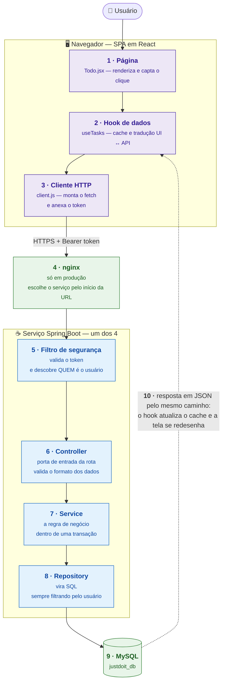

# 0. O fluxo inteiro em um diagrama

Este é o diagrama para **abrir a apresentação** e para responder "explica como
funciona". Ele mostra o caminho completo de uma ação do usuário — do clique até
o banco e de volta — sem entrar em nenhum detalhe.

Todos os outros arquivos desta pasta são aprofundamentos de alguma caixa daqui.

## Roteiro de fala — uma frase por caixa

| # | Frase |
|---|---|
| 1 | O usuário clica; a página só renderiza, ela não sabe falar com o servidor. |
| 2 | O hook cuida dos dados: guarda em cache e traduz o vocabulário da tela para o da API. |
| 3 | Um único arquivo faz todas as chamadas HTTP do sistema — e é ele que anexa o token. |
| 4 | Em produção existe um proxy na frente que, pelo começo da URL, escolhe qual dos quatro serviços responde. |
| 5 | O primeiro filtro confere a assinatura do token e extrai dele **quem** é o usuário. |
| 6 | O controller recebe a request já autenticada e checa se os dados vieram no formato certo. |
| 7 | O service aplica a regra de negócio, tudo dentro de uma transação. |
| 8 | O repository transforma isso em SQL — e toda busca leva junto o id do usuário. |
| 9 | O banco grava ou devolve as linhas. |
| 10 | A resposta volta em JSON, o cache do frontend é atualizado e a tela se redesenha sozinha. |

## As três frases que resumem o desenho

**O usuário nunca diz quem ele é.** O id dele sai do token, no passo 5. Não
existe nenhuma rota que aceite um id de usuário — por isso não há como pedir os
dados de outra pessoa.

**Cada camada só conversa com a vizinha.** A página não chama o servidor, o
controller não fala com o banco. Trocar uma peça mexe em um lugar só.

**O servidor é a única fonte da verdade.** No navegador ficam apenas os tokens;
tarefa, nota e categoria são sempre buscadas.

## Se perguntarem mais fundo

| Pergunta | Arquivo |
|---|---|
| "E as outras telas / rotas?" | [13-rotas.md](13-rotas.md) |
| "Como funciona o login?" | [02-autenticacao.md](02-autenticacao.md) |
| "Detalha o lado do navegador" | [15-fluxo-frontend.md](15-fluxo-frontend.md) |
| "Detalha o lado do servidor" | [14-fluxo-em-camadas.md](14-fluxo-em-camadas.md) |
| "Quais são as peças e os 4 serviços?" | [01-visao-geral.md](01-visao-geral.md) |
| "Onde isso roda de verdade?" | [12-topologia-deploy.md](12-topologia-deploy.md) |
