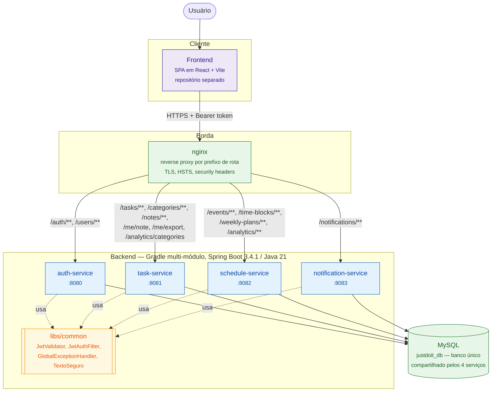
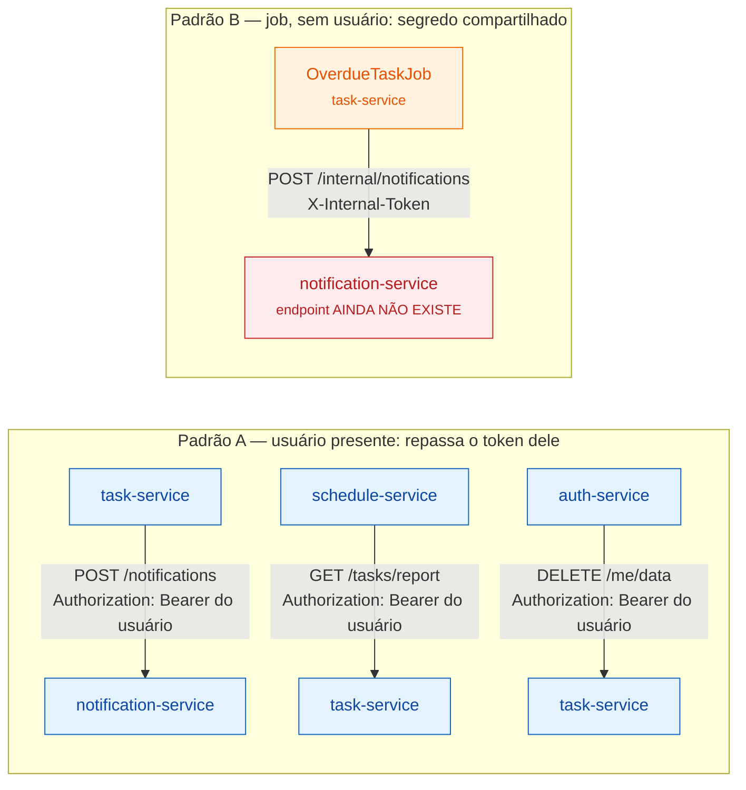

# 1. Visão geral — as peças e quem fala com quem

## Containers

## Comunicação entre serviços

Não há service discovery, message broker nem API gateway com lógica. Os serviços
se falam por **HTTP direto**, e sempre há um dos dois padrões abaixo.

## O que explicar em cima disso

**Por que 4 serviços com um banco só.** A separação é de *responsabilidade e
deploy* (cada serviço sobe, cai e escala sozinho), não de dados. Um banco único
elimina transação distribuída e mantém o projeto operável — o custo é que o
isolamento de dados é por convenção, não pelo schema.

**Como o token atravessa os serviços sem acoplá-los.** O auth-service é o único
emissor de token. Os outros três só *validam*, com o mesmo segredo HMAC, usando
o `JwtValidator` de `libs/common`. Nenhum serviço precisa chamar o auth para
autenticar uma request — não existe dependência de runtime entre eles no caminho
de autenticação.

**Por que o padrão A é o normal.** Repassar o token do usuário significa que a
chamada entre serviços passa pela mesma autorização de uma chamada do navegador:
o serviço chamado extrai o `userId` do JWT e nunca aceita um `userId` vindo no
corpo. Não existe credencial de serviço com poder amplo.

**A pendência do padrão B.** `NotificationClient.notifyTaskOverdue` faz `POST
/internal/notifications`, mas esse endpoint **não está implementado** no
notification-service. Como o cliente engole qualquer falha (é *best-effort*), o
efeito hoje é: a tarefa é marcada `OVERDUE` corretamente e a notificação de
atraso simplesmente não chega — só sai um `WARN` no log. Vale citar como o
próximo passo, não como bug silencioso descoberto na apresentação.
