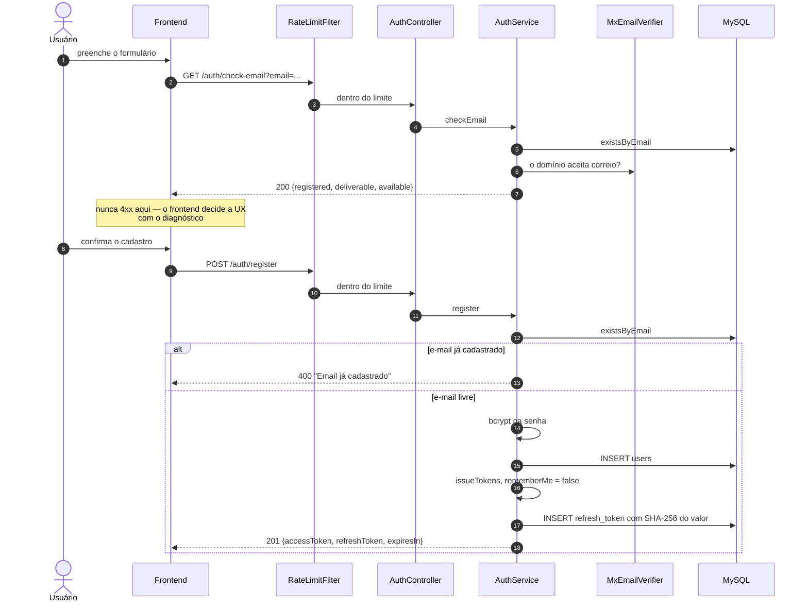
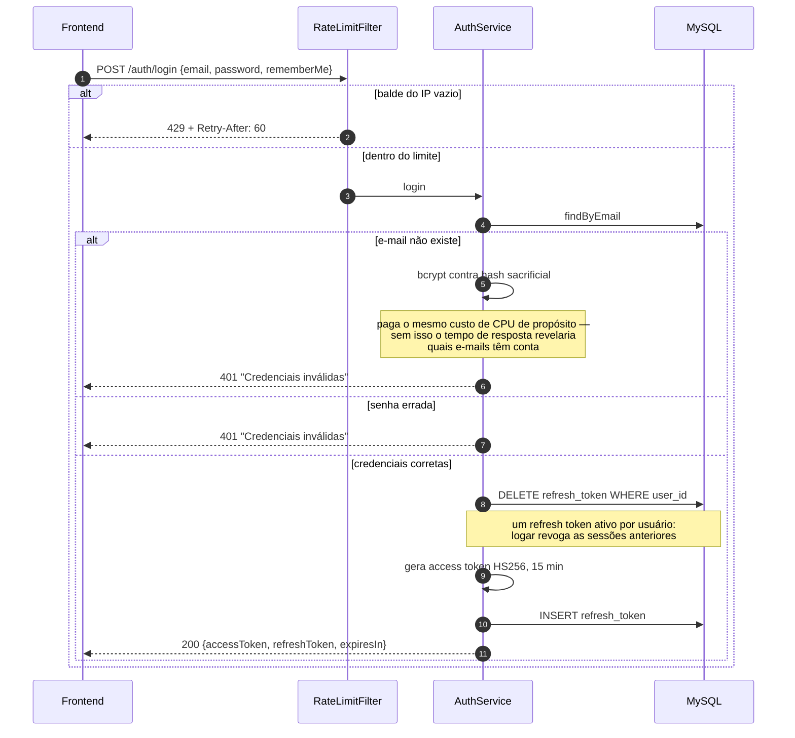
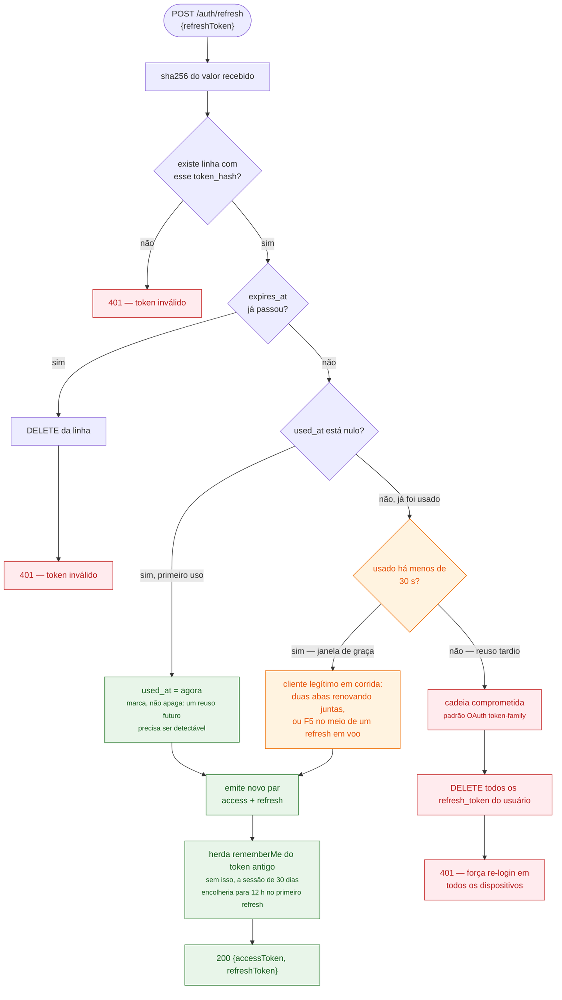
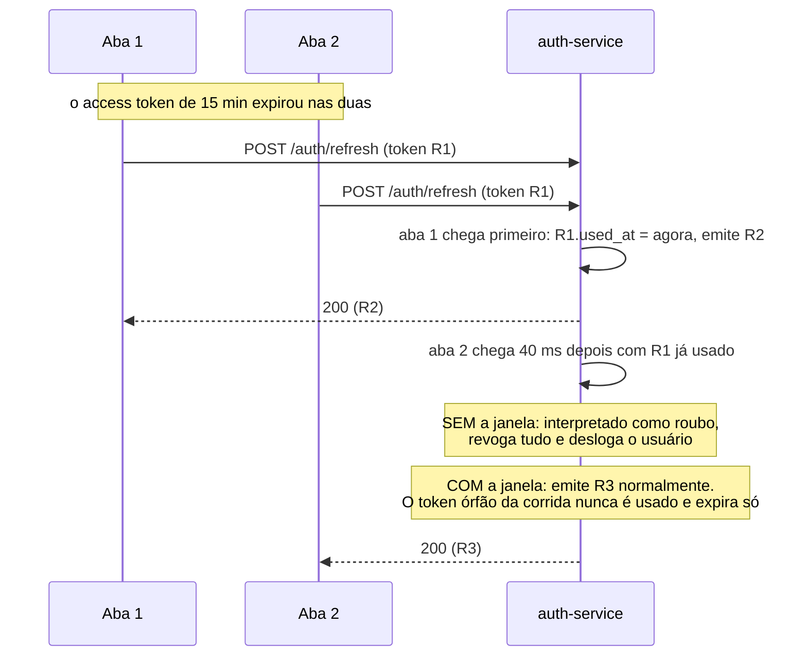
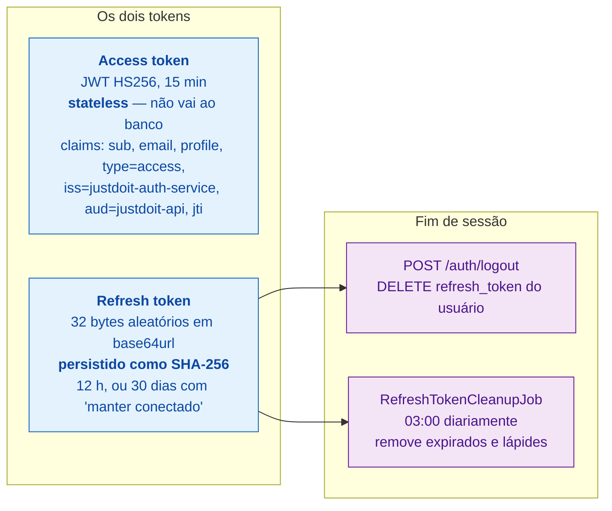

# 2. Autenticação — cadastro, login, refresh e logout

## 2.1 Cadastro

Conta nova nasce sempre com sessão curta — 12 h — equivalente ao "manter
conectado" desmarcado.

## 2.2 Login

A mensagem de erro é **a mesma** para e-mail inexistente e senha errada, e o
tempo de resposta também. As duas coisas juntas fecham o oráculo de enumeração
de contas — uma sozinha não resolve.

## 2.3 Refresh — rotação com detecção de reuso

Esta é a parte mais sutil do sistema. O refresh token é rotacionado a cada uso, e
um token já usado que reaparece pode ser **duas coisas muito diferentes**: roubo,
ou o cliente legítimo em corrida consigo mesmo.

### Por que a janela de 30 s existe

Sem ela, o cenário abaixo deslogava o usuário legítimo a cada ciclo de access
token:

## 2.4 Prazos e logout

**Por que só o refresh token é persistido.** O access token vale 15 min e é
verificado por assinatura — guardá-lo no banco só criaria uma consulta por
request sem ganho real. O refresh vale até 30 dias, então precisa ser revogável,
e por isso vive no banco. Guardado como **hash**: um dump da tabela
`refresh_token` não dá sessão a ninguém.

**Logout não invalida o access token.** Ele continua válido até expirar — no pior
caso 15 min. É a troca consciente que o modelo stateless impõe. O claim `jti` já
está no token justamente para permitir uma blacklist no futuro sem mudar o
contrato.
