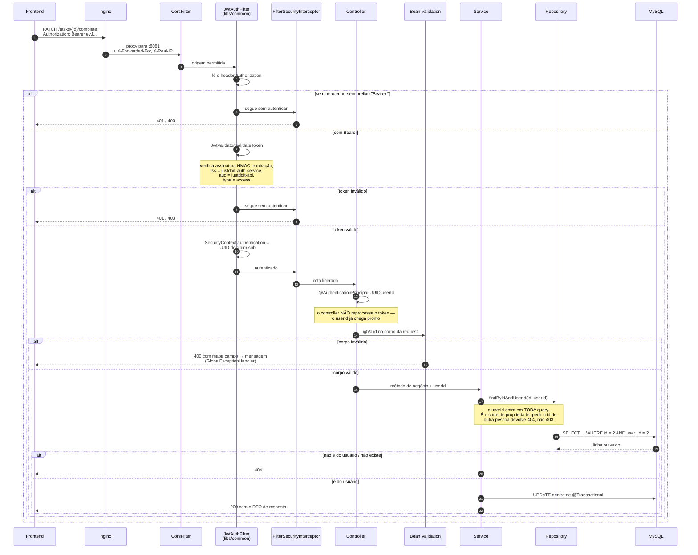
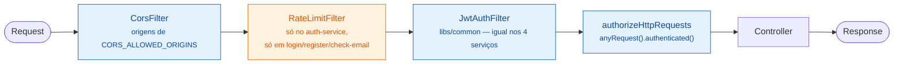

# 3. O caminho de uma request autenticada

Do clique no navegador até o banco. Este diagrama vale para **qualquer** endpoint
autenticado dos quatro serviços — a cadeia é a mesma, porque vem toda de
`libs/common`.

## A cadeia de filtros, em ordem

Configuração idêntica nos quatro serviços: CSRF desabilitado, `httpBasic` e
`formLogin` desabilitados, sessão `STATELESS`. Só o auth-service tem exceções
públicas — `/auth/register`, `/auth/login`, `/auth/refresh`, `/auth/check-email`.
Todo o resto, nos quatro serviços, exige token.

## Dois detalhes que valem citar

**`shouldNotFilterErrorDispatch` retorna `false`.** Por padrão o
`OncePerRequestFilter` do Spring não roda no dispatch interno para `/error`. Sem
essa sobrescrita, qualquer erro real — 400 de corpo inválido, 405 de método
errado — era re-despachado **sem autenticação**; como toda rota exige
autenticação, o erro voltava ao frontend mascarado como **403**. Rodando o filtro
também no `/error`, o status verdadeiro chega ao cliente.

**O `userId` nunca vem do cliente.** Não existe nenhum endpoint que aceite
`userId` como parâmetro de query ou campo de corpo. Ele vem sempre do claim `sub`
do token, injetado pelo filtro. É isso que torna impossível pedir os dados de
outra pessoa — não há onde escrever o id dela.
