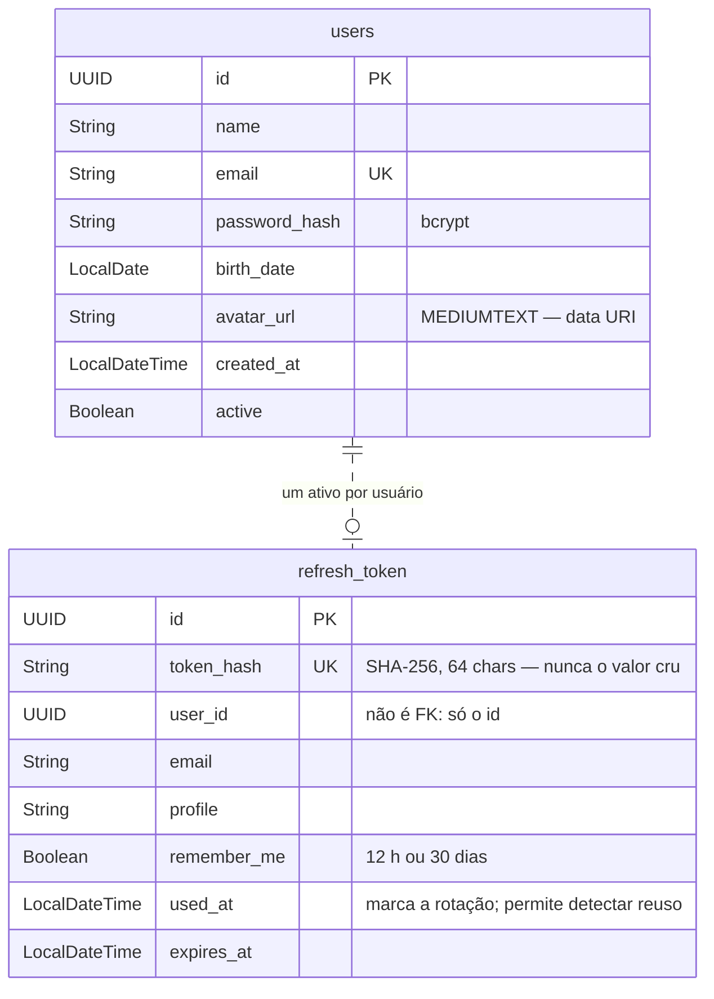
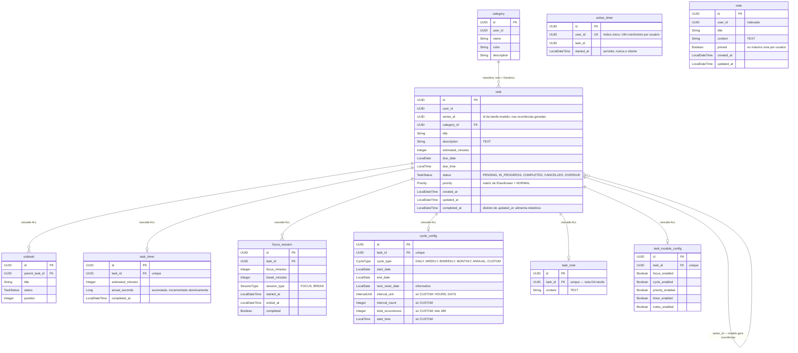
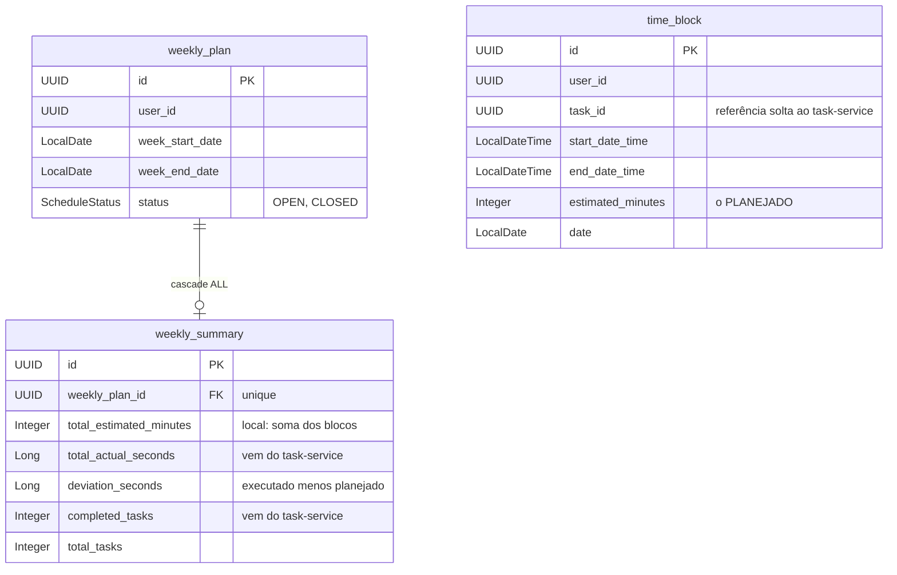
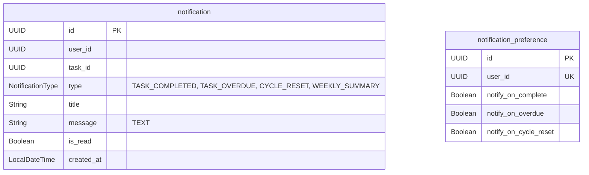

# 4. Modelo de dados

Banco único `justdoit_db`, tabelas geradas pelo Hibernate com `ddl-auto=update`
(não há Flyway). Os quatro serviços compartilham o banco, mas **cada tabela
pertence a um serviço só** — a fronteira é de código, não de schema.

## 4.1 auth-service

## 4.2 task-service — `task` é o aggregate root

`active_timer` e `note` não têm FK para `task`: `active_timer` é por **usuário**
(o `task_id` é só referência) e `note` é anotação livre, sem tarefa.

## 4.3 schedule-service

## 4.4 notification-service

## Decisões do modelo que valem explicar

**`user_id` como UUID solto, sem FK entre serviços.** `task.user_id`,
`time_block.user_id` e `notification.user_id` apontam para `users.id`, mas **não
há foreign key**. Se houvesse, o schema amarraria os serviços entre si e um
`DELETE` em `users` teria efeito colateral em tabelas de outro dono. A
consistência é mantida no código — ver [10-exclusao-de-conta.md](10-exclusao-de-conta.md).

**`completed_at` separado de `updated_at`.** `updated_at` muda em qualquer edição
(corrigir um título, mover de categoria). Para responder "quantas tarefas foram
concluídas nesta semana" é preciso um campo que só registre a conclusão — é o que
o schedule-service consome via `/tasks/report`.

**`active_timer` separado de `task_timer`.** `task_timer` guarda o **acumulado**
por tarefa; `active_timer` guarda a **contagem em curso** por usuário. Separar
permite o índice único em `user_id`, que é a garantia real de um cronômetro por
usuário — ver [06-cronometro.md](06-cronometro.md).

**`series_id` auto-referenciando `task`.** A tarefa que possui o `cycle_config` é
o **modelo** e fica com `series_id` nulo. As ocorrências geradas recebem
`series_id = id do modelo`. Isso permite contar, limitar e limpar as ocorrências
futuras de uma série sem tabela extra.
