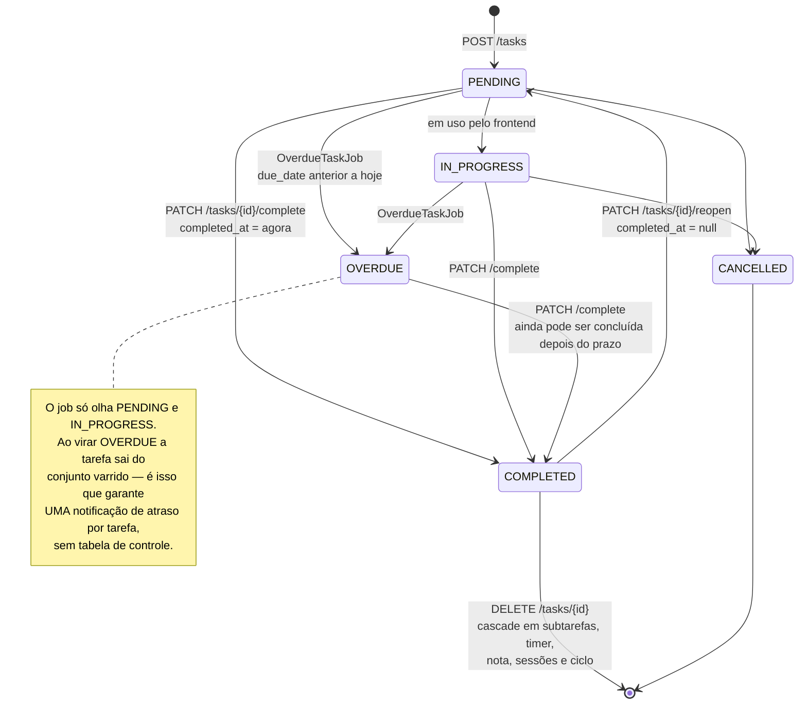
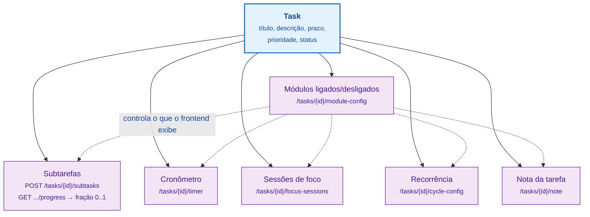
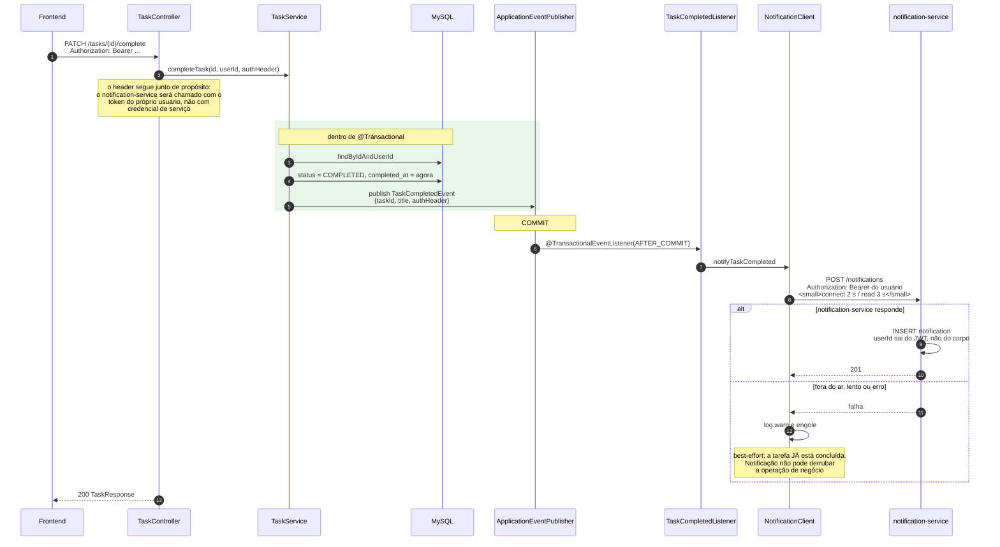

# 5. Ciclo de vida de uma tarefa

## 5.1 Estados

`CANCELLED` existe no enum `TaskStatus` mas nenhum endpoint transiciona para ele
hoje — está reservado.

## 5.2 O módulo de uma tarefa

Uma tarefa é o *aggregate root*: cada capacidade é uma entidade satélite, criada
sob demanda. Uma tarefa simples tem só a linha em `task`.

## 5.3 Conclusão de tarefa e a notificação

O ponto interessante: a notificação sai **depois do commit**, não durante a
transação.

### As duas decisões que esse diagrama mostra

**`AFTER_COMMIT`, não durante a transação.** Se a transação sofresse rollback
depois do envio, o usuário receberia notificação de uma conclusão que não
aconteceu. Publicando o evento dentro da transação mas consumindo depois do
commit, a notificação só existe se a conclusão existir.

**Best-effort com timeout curto.** O envio roda no caminho da request do usuário.
Um notification-service lento seguraria a resposta de "concluir tarefa" — daí
`connectTimeout` 2 s, `readTimeout` 3 s, e qualquer exceção virando `WARN`. O
usuário nunca vê erro por causa de uma notificação.
