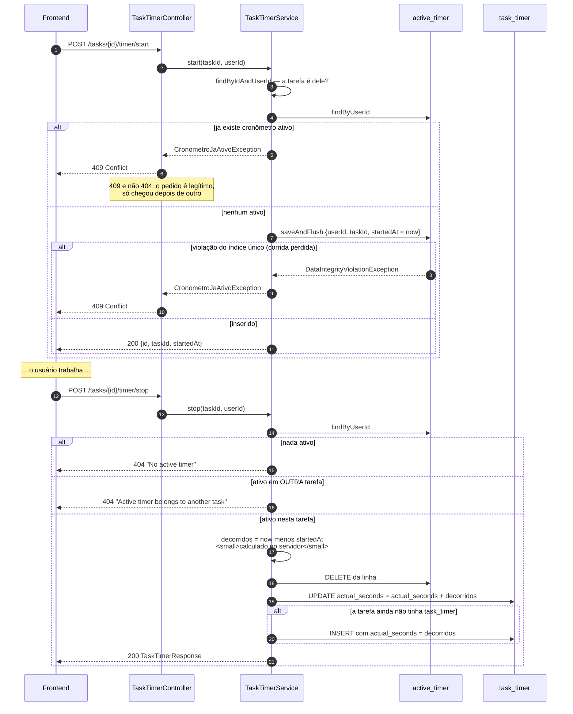
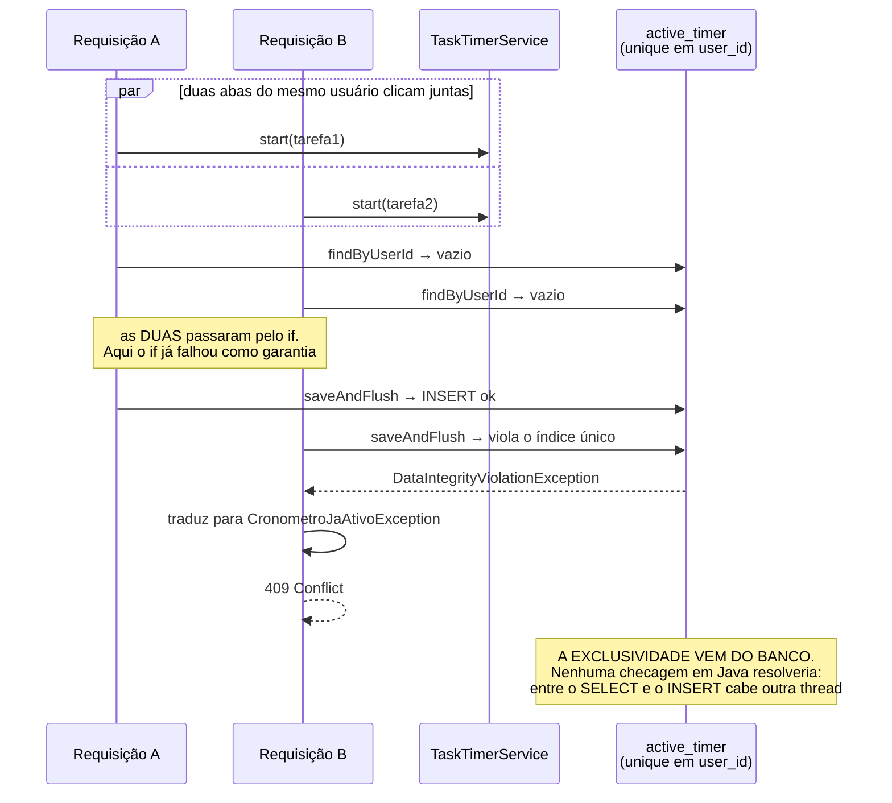
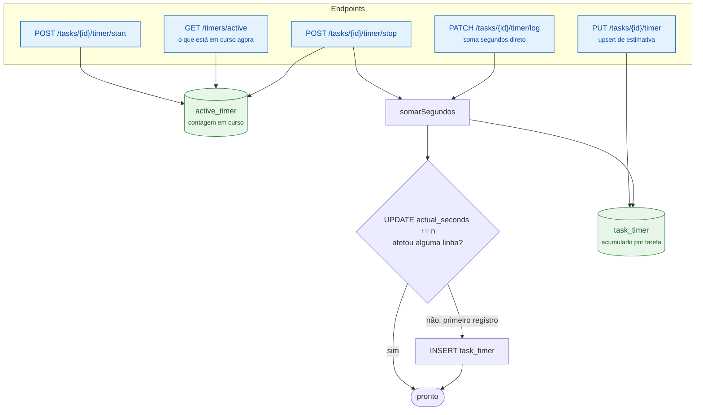

# 6. Cronômetro — medição de tempo e exclusividade

O tempo é medido **pelo servidor**, nunca pelo cliente. E cada usuário só pode ter
**um** cronômetro rodando por vez.

## 6.1 Start e stop

## 6.2 Por que o índice único é a garantia, e não o `if`

Este é o ponto que rende pergunta de banca. O `if` antes do insert **não** é a
proteção — é só um atalho para o caso comum.

Dois detalhes de implementação que sustentam isso:

- **`saveAndFlush`, não `save`.** Com `save`, a violação só apareceria no commit
  — fora do `try/catch`, virando 500. O `flush` explícito força o erro a
  acontecer dentro do bloco onde é tratado.
- **O rollback é inofensivo.** Esse insert é a única escrita da operação, então
  perder a transação não desfaz nada que importe.

Há evidência visual desse teste de concorrência em
[`docs/img/metrica-3-cronometro-concorrente.png`](../img/metrica-3-cronometro-concorrente.png).

## 6.3 Os três caminhos de escrita de tempo

**Por que `UPDATE ... += n` em vez de ler-somar-salvar.** O incremento é uma única
instrução SQL atômica. Ler o valor em Java, somar e salvar abriria uma condição de
corrida onde dois logs simultâneos perderiam um dos dois. O `INSERT` só acontece
quando o `UPDATE` não afeta linha nenhuma — ou seja, é o primeiro log de tempo
daquela tarefa. Isso dispensa o frontend de fazer um `PUT` prévio para criar o
timer.

**`GET /timers/active` existe para sobreviver ao F5.** Como a contagem vive no
servidor, recarregar a página não perde o cronômetro: o frontend pergunta o que
está ativo e recalcula o tempo decorrido a partir do `startedAt`.
