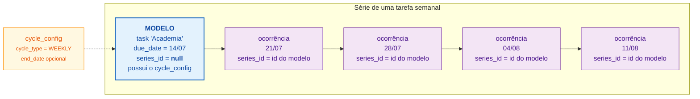
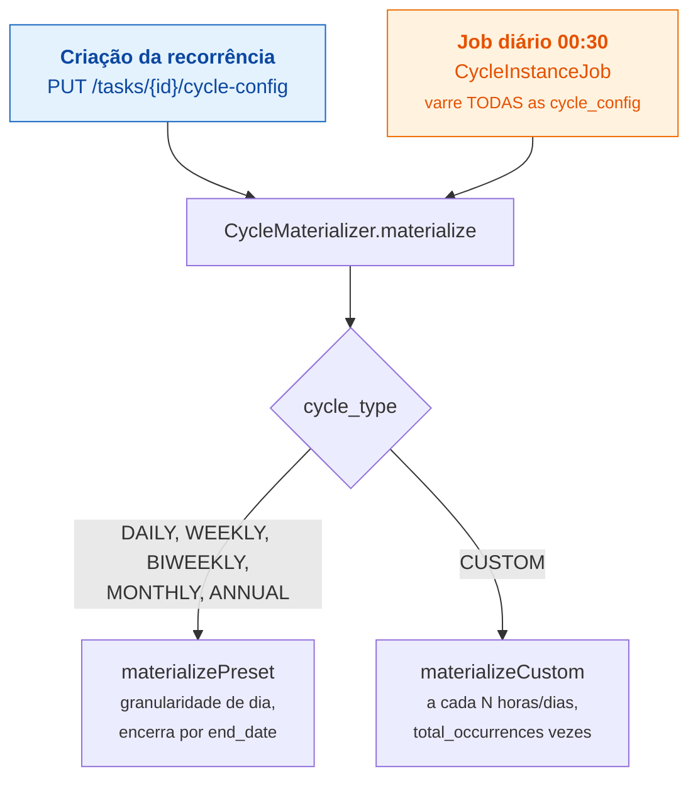
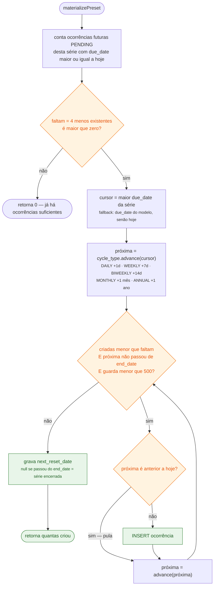
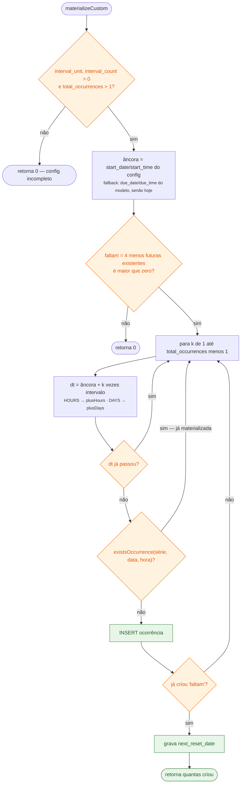
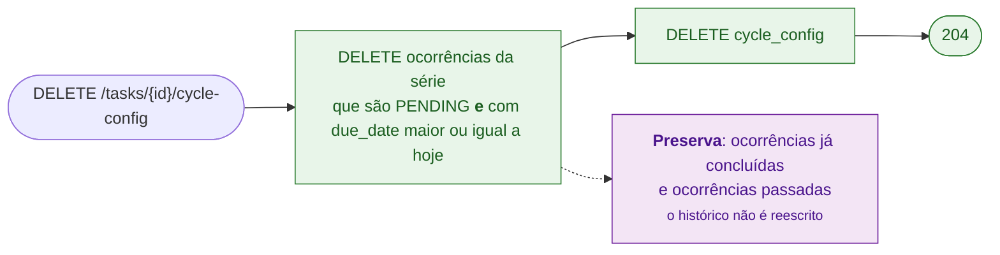

# 7. Tarefas cíclicas — materialização das ocorrências

Uma tarefa recorrente não é "uma tarefa que se repete virtualmente": as
ocorrências futuras são **tarefas reais no banco**, com data, para aparecerem no
calendário e na lista como qualquer outra.

## 7.1 O conceito de série

O modelo **conta como a primeira ocorrência**. As geradas são cópias só dos campos
base — título, descrição, prioridade, categoria, data, hora. Não levam
subtarefas, timer, nota nem `cycle_config`.

## 7.2 Quando a materialização acontece

A geração acontece **na criação** — o usuário vê as ocorrências no calendário
imediatamente. O job diário só **rola a janela** conforme os dias passam: repõe as
ocorrências que entraram no horizonte.

## 7.3 Presets — limite por quantidade

**O limite é por quantidade — no máximo 4 futuras por série — e não por dias.**
Isso é deliberado: com limite por janela de tempo, "diário" geraria 30 tarefas e
"anual" nenhuma. Por quantidade, diário, semanal e quinzenal geram sempre o mesmo
número pequeno, e nunca há enxurrada.

**A contagem é o que torna a operação idempotente.** Chamar `materialize` de novo
— na criação, ao re-salvar a config, no job diário — não passa do limite, porque a
primeira coisa que ele faz é contar o que já existe. Não há tabela de controle nem
flag de "já materializado".

**`MAX_ITERACOES = 500`** é trava contra laço patológico: uma série com cursor
muito antigo teria que "alcançar" hoje avançando de 1 em 1 dia.

## 7.4 CUSTOM — a cada N horas ou dias

Diferenças em relação aos presets:

- A posição da ocorrência *k* é calculada **da âncora**, não do cursor anterior —
  `âncora + k * intervalo`. Isso permite pular ocorrências já passadas sem
  desalinhar as seguintes.
- A idempotência vem de `existsOccurrence(série, data, hora)`, não da contagem —
  precisa ser por data+hora porque `HOURS` gera várias ocorrências no mesmo dia.
- `total_occurrences` tem teto de **365** (validado no service), e o laço é
  limitado por ele.

## 7.5 Remover a recorrência

