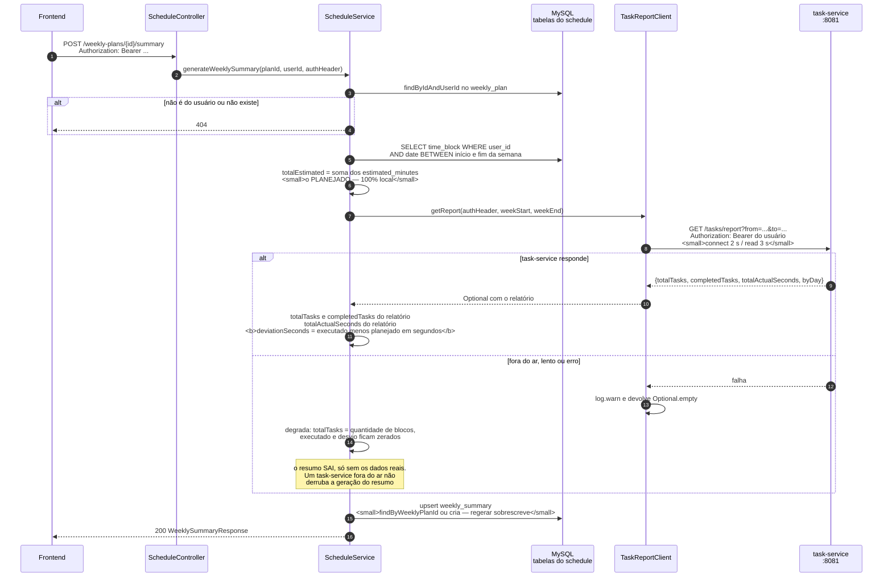
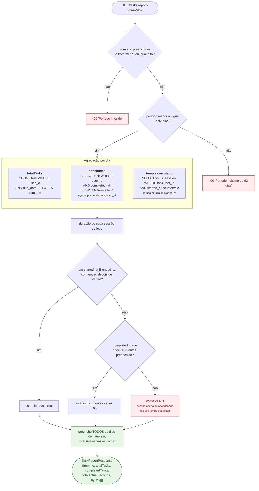

# 8. Resumo semanal — planejado versus executado

Este é o único fluxo que **cruza dois serviços para produzir um dado novo**. O
schedule-service sabe o que foi *planejado* (blocos de tempo); o task-service sabe
o que foi *executado* (tarefas concluídas e sessões de foco). O resumo é o
encontro dos dois.

## 8.1 O fluxo

`GET /weekly-plans/{id}/summary` chama **o mesmo método** de `POST`: consultar o
resumo é sempre regerá-lo com dados frescos, em vez de devolver um snapshot velho.

## 8.2 Como o task-service calcula o relatório

## 8.3 Por que o desenho é esse

**O teto de 92 dias.** O consumidor real pede uma semana. Sem teto, um `from`
antigo viraria varredura da base inteira do usuário — é limite de segurança de
performance, não regra de negócio.

**`/tasks/report` é um endpoint normal, não interno.** É autenticado com o token
do usuário como qualquer outro. O `TaskReportClient` só repassa o header que já
chegou. Nenhuma credencial especial, nenhuma rota privilegiada.

**A degradação é assimétrica de propósito.** O dado *planejado* é local e nunca
falha. O dado *executado* é remoto e pode faltar. O resumo prefere sair
incompleto a não sair: o usuário vê o planejado e as métricas reais aparecem na
próxima geração, quando o task-service responder.

**Unidades diferentes nos dois lados.** O planejado é em **minutos** (o usuário
estima em minutos ao criar o bloco); o executado é em **segundos** (o cronômetro
mede em segundos). O desvio é calculado em segundos —
`totalActualSeconds - totalEstimated * 60`.
