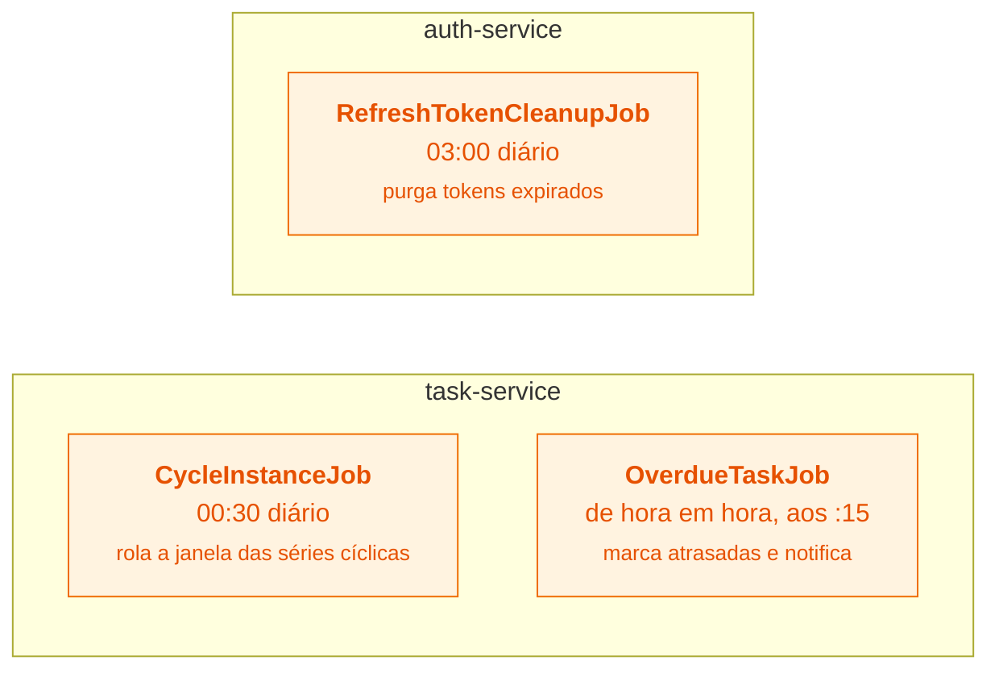
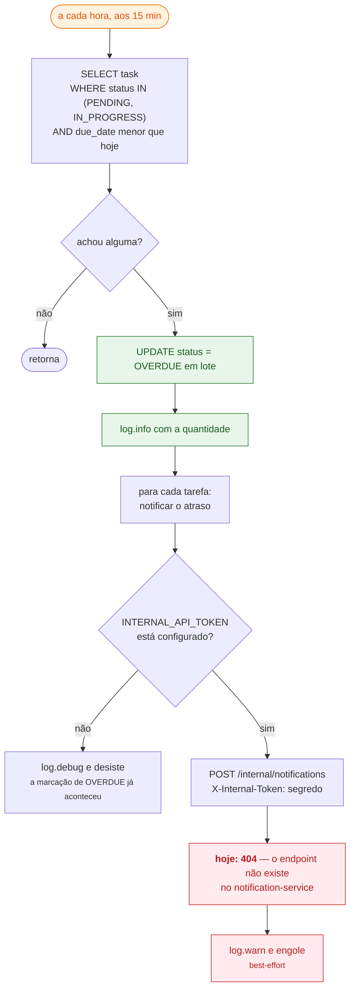
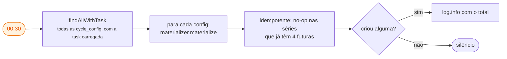
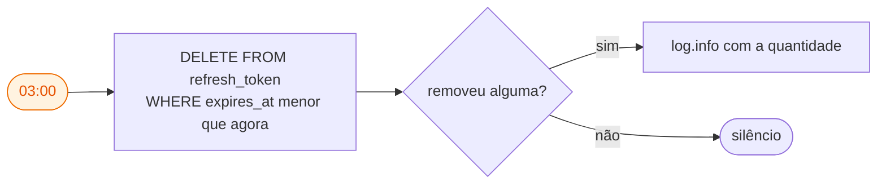

# 9. Jobs agendados — o que o sistema faz sozinho

Três jobs, todos com `@Scheduled` do Spring. Nenhum depende de usuário logado.

| Horário | Job | Serviço | Cron |
|---|---|---|---|
| 00:30, diário | `CycleInstanceJob` | task-service | `0 30 0 * * *` |
| todas as horas, aos :15 | `OverdueTaskJob` | task-service | `0 15 * * * *` |
| 03:00, diário | `RefreshTokenCleanupJob` | auth-service | `0 0 3 * * *` |

## 9.1 OverdueTaskJob — `0 15 * * * *`, de hora em hora

Três decisões aqui:

- **O corte é por dia, não por hora.** `due_date < hoje` — a tarefa tem o dia
  inteiro do prazo como graça, e `due_time` é ignorado de propósito.
- **A mudança de status é o controle de duplicidade.** Ao virar `OVERDUE`, a
  tarefa sai do conjunto varrido. Cada tarefa gera **uma** notificação de atraso,
  sem tabela de "já notifiquei".
- **A marcação não depende da notificação.** Marcar `OVERDUE` acontece mesmo com o
  notification-service fora do ar.

> **Pendência conhecida:** `POST /internal/notifications` ainda não está
> implementado no notification-service. Hoje o atraso é marcado corretamente e a
> notificação não chega — só sai `WARN` no log. Este é o único caso do sistema
> em que a comunicação usa segredo compartilhado em vez do token do usuário,
> justamente porque não há usuário presente para emprestar um token.

## 9.2 CycleInstanceJob — `0 30 0 * * *`, 00:30 diariamente

**Por que varrer tudo é seguro.** O `CycleMaterializer` limita por quantidade e
começa contando o que já existe — séries cheias custam uma contagem e retornam 0.
Detalhes em [07-recorrencia.md](07-recorrencia.md).

## 9.3 RefreshTokenCleanupJob — `0 0 3 * * *`, 03:00 diariamente

**Por que existe.** Sem ele, a tabela `refresh_token` só era limpa quando o
próprio usuário usava o token, logava ou deslogava. As "lápides" — linhas com
`used_at` preenchido, mantidas de propósito para detectar reuso — nunca sairiam
sozinhas de uma conta abandonada. A tabela cresceria indefinidamente.

## Onde os jobs rodam em produção

Cada job é `@Scheduled` **dentro do processo do serviço**. Não há Quartz nem lock
distribuído — o que significa que **com mais de uma réplica do mesmo serviço, o
job rodaria em todas**. Hoje o deploy é de instância única por serviço, então não
é problema; é o ponto a resolver antes de escalar horizontalmente. O mesmo vale
para o `RateLimitFilter`, cujo balde de fichas é local ao processo.
