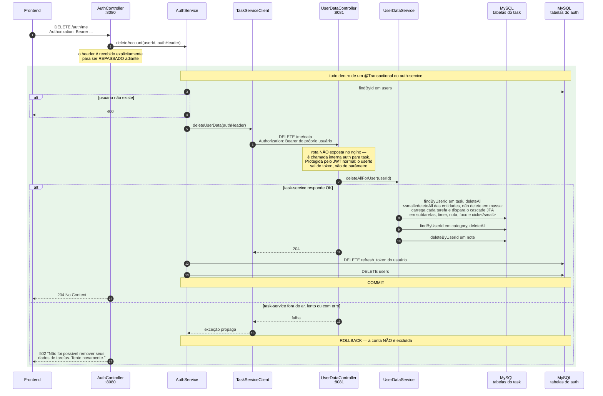
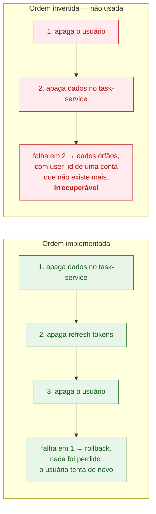
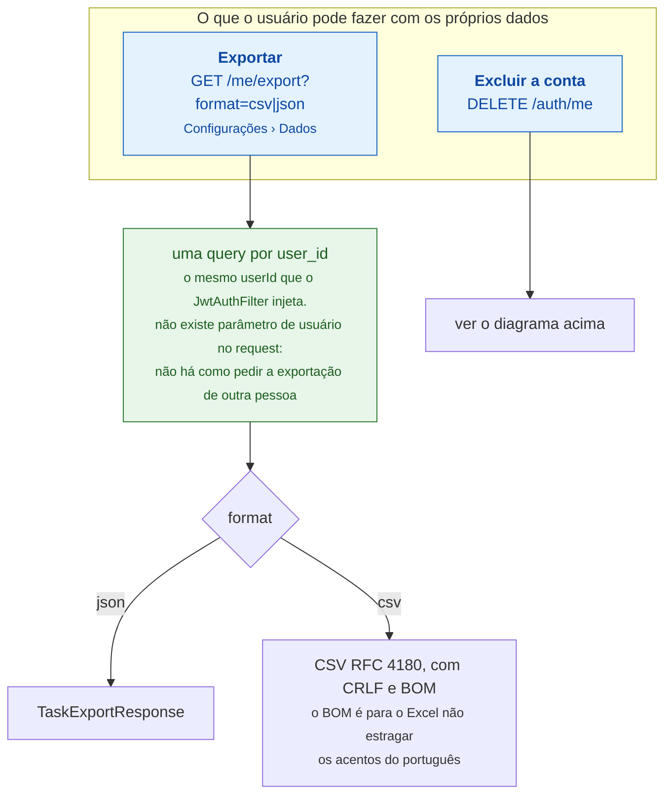

# 10. Exclusão de conta — consistência entre dois serviços

Os dados do usuário vivem em **dois serviços**: a identidade no auth-service
(`users`, `refresh_token`) e o conteúdo no task-service (`task`, `category`,
`note` e satélites). Não há FK entre eles nem transação distribuída — a
consistência é orquestrada no código, com ordem deliberada.

## A ordem importa

**Apagar o mais frágil primeiro.** A chamada remota é a parte que pode falhar, e
ela é a primeira. Se falhar, a transação local reverte e o estado volta a ser
consistente — o usuário só vê um 502 e pode repetir. Na ordem inversa, uma falha
deixaria dados órfãos permanentes.

**O que essa exclusão *não* apaga.** O notification-service e o schedule-service
não são chamados: `notification`, `notification_preference`, `time_block`,
`weekly_plan` e `weekly_summary` do usuário **permanecem no banco**. Vale citar
como limitação conhecida — a orquestração cobre auth e task, não os quatro
serviços.

## Fluxos relacionados dos dados do usuário

