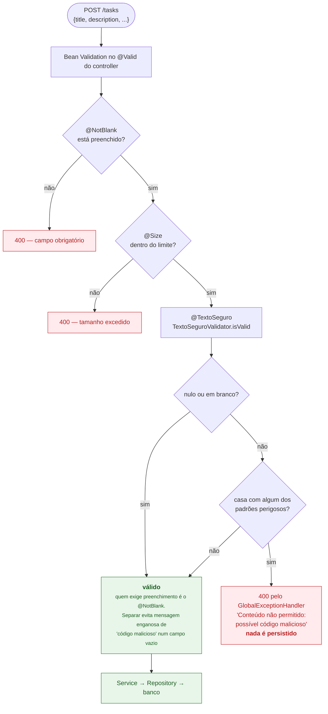
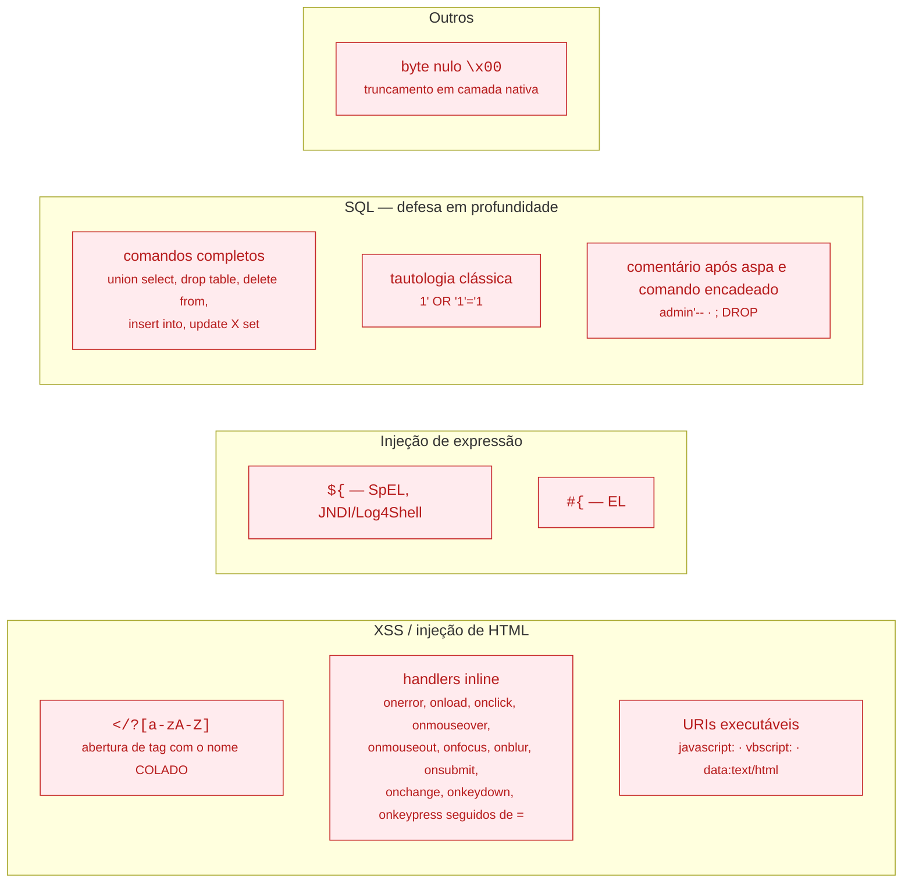
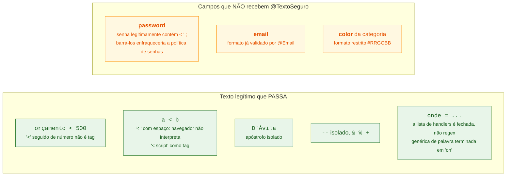
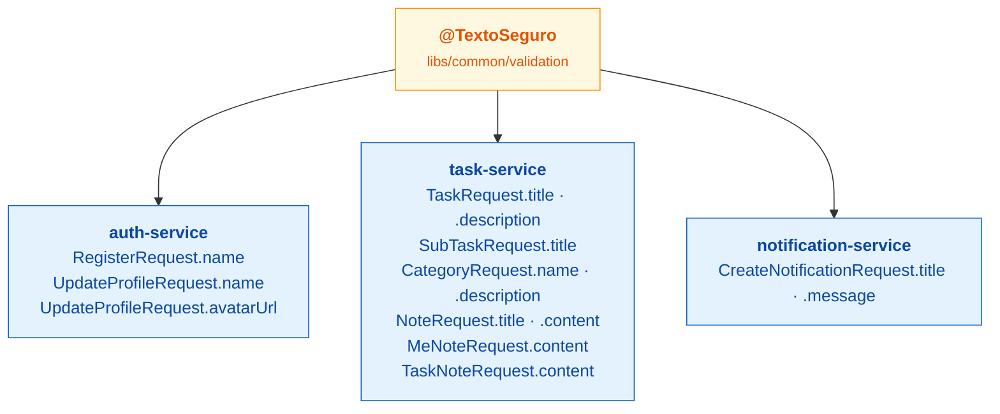

# 11. Validação de entrada — barrando texto malicioso

Todo campo de texto livre que o usuário preenche passa por `@TextoSeguro`, uma
constraint de Bean Validation que vive em `libs/common` e é reusada pelos quatro
serviços.

## 11.1 O fluxo

## 11.2 O que é rejeitado

## 11.3 O que **não** é rejeitado, e por quê

Esta é a parte mais importante de explicar: a lista é deliberadamente
**específica**, não genérica. O objetivo é **zero falso positivo em português
legítimo**.

## 11.4 Onde a constraint está aplicada

## Decisões de política

**Rejeitar, não sanitizar.** Zero Trust: um 400 explícito em vez de limpar o
conteúdo em silêncio. Sanitizar alteraria o que o usuário escreveu sem ele
perceber — e um filtro de sanitização mal-feito é uma falsa sensação de
segurança. O usuário vê o erro e corrige.

**SQL Injection já é estruturalmente impossível.** Todo acesso a dados é via
Spring Data com query parametrizada — não existe query nativa concatenada no
projeto. Os padrões de SQL em `@TextoSeguro` são **defesa em profundidade**, não a
proteção principal. Isso vale dizer explicitamente: a proteção real é a
arquitetura de acesso a dados, o validador é a segunda camada.

**A responsabilidade é separada.** `@NotBlank` cuida de preenchimento, `@Size` de
tamanho, `@TextoSeguro` de conteúdo perigoso. Um campo vazio nunca recebe a
mensagem "possível código malicioso".

Há testes de qualidade cobrindo isso em cada serviço
(`ValidacaoEntradaMetricsTest`), e as métricas estão em
[`docs/METRICAS-QUALIDADE.md`](../METRICAS-QUALIDADE.md) e
[`docs/EVIDENCIAS-QUALIDADE.md`](../EVIDENCIAS-QUALIDADE.md).
