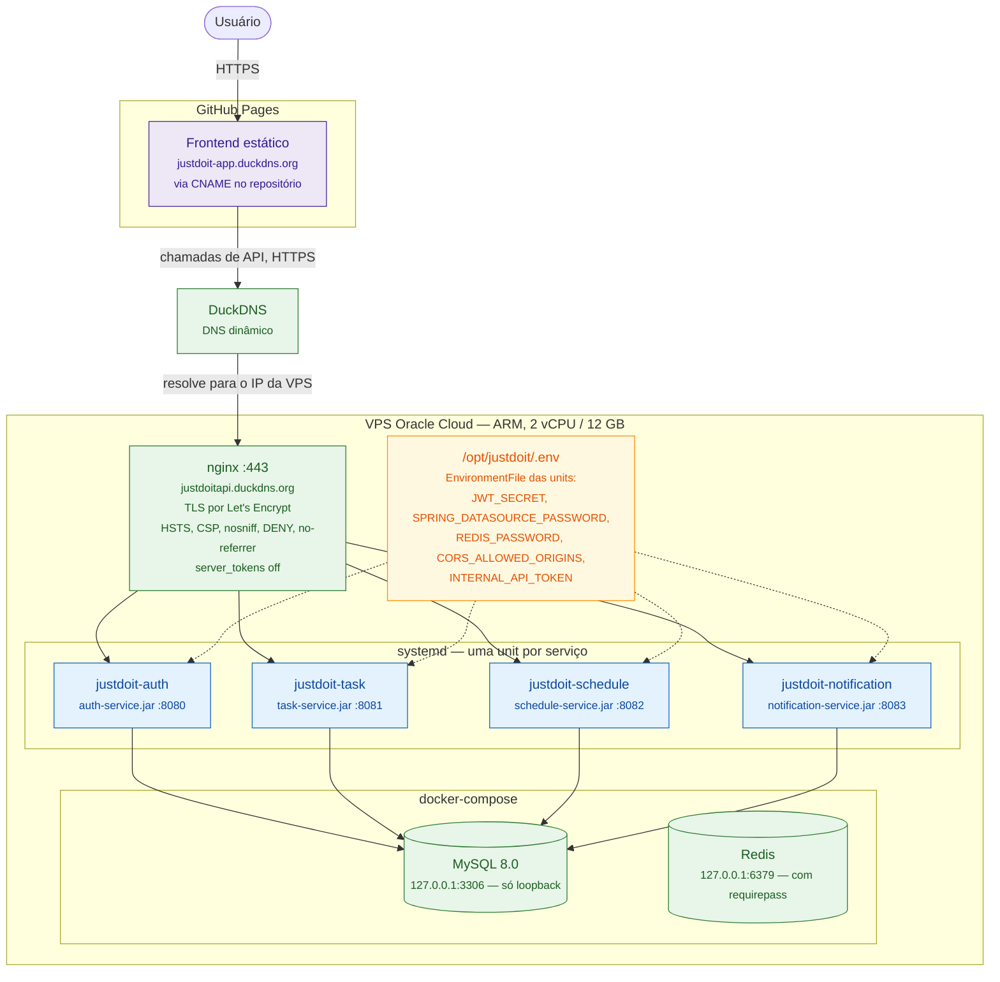
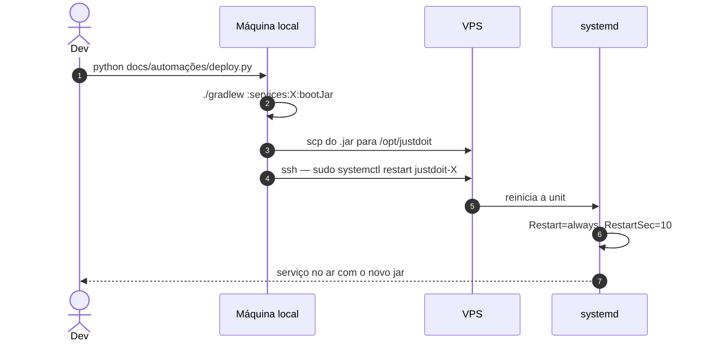
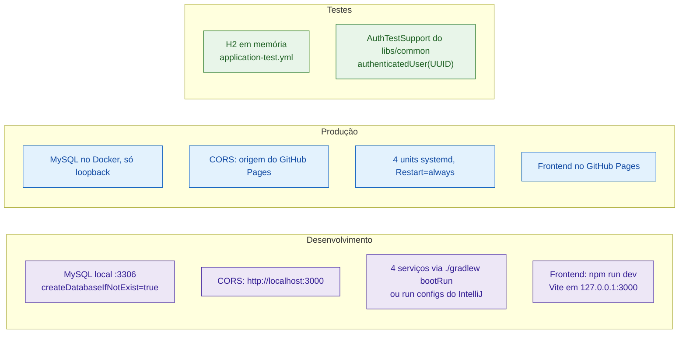

# 12. Topologia de produção e deploy

## 12.1 Onde cada coisa roda

Frontend e backend estão em **hosts diferentes** — daí o CORS ser configuração de
produção, não só de desenvolvimento. Cada serviço lê as origens permitidas de
`CORS_ALLOWED_ORIGINS`.

O Redis sobe no compose mas **nenhum serviço o usa** hoje — está provisionado para
o balde de rate limit compartilhado, quando houver mais de uma réplica.

## 12.2 O deploy

O `deploy.py` também tem um modo `setup` que provisiona a VPS de zero: instala
Java 21, Docker e nginx, copia `docker-compose.yml`, `nginx.conf` e as units,
habilita tudo no systemd, sobe MySQL e Redis e roda o certbot.

## 12.3 Configuração por ambiente

## Pontos operacionais que valem citar

**O schema é gerenciado pelo Hibernate** (`ddl-auto=update`), sem Flyway. Funciona
para o estágio atual, mas significa que não há migração versionada nem rollback de
schema — é o ponto a resolver antes de qualquer mudança destrutiva em tabela.

**Sem lock distribuído.** Os jobs `@Scheduled` e o balde do `RateLimitFilter` são
locais ao processo. O deploy é de instância única por serviço, então funcionam;
escalar horizontalmente exige resolver os dois — ver
[09-jobs-agendados.md](09-jobs-agendados.md).

**`iptables` precisa ser persistido.** As regras das portas 80/443 na VPS Oracle
não sobrevivem ao reboot se não forem salvas — é armadilha conhecida deste
ambiente.

**O nginx não expõe rotas internas.** `/me/data` e `/internal/**` ficam fora de
qualquer `location`: são alcançáveis apenas de dentro da VPS, entre os serviços.

Detalhes completos de infraestrutura em
[`docs/INFRA-DEPLOY.md`](../INFRA-DEPLOY.md).
