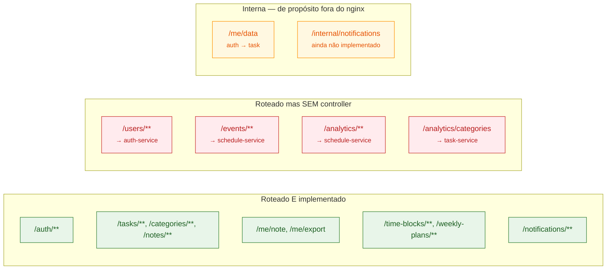
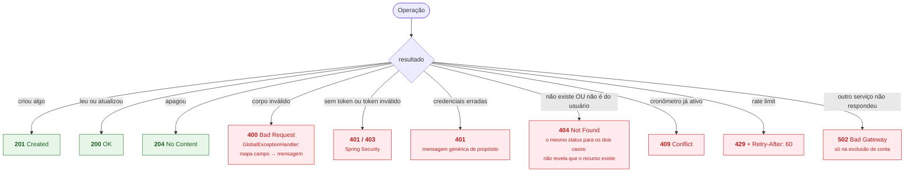

# 13. Inventário de rotas — todas as portas de entrada da API

Todas as rotas expostas pelos quatro serviços. Extraídas dos `@RequestMapping` /
`@GetMapping` / `@PostMapping` / `@PutMapping` / `@PatchMapping` /
`@DeleteMapping` de cada controller.

**Regra geral:** toda rota exige `Authorization: Bearer <access token>`, **exceto**
as quatro marcadas como públicas. O `userId` nunca é parâmetro — vem sempre do
claim `sub` do token.

## 13.1 auth-service — porta 8080

`AuthController` — prefixo `/auth`

| Método | Rota | Auth | O que faz |
|---|---|---|---|
| POST | `/auth/register` | **pública** | Cria a conta. `201` com o par de tokens, `400` se o e-mail já existe |
| POST | `/auth/login` | **pública** | Autentica. `200` com o par de tokens, `401` credenciais inválidas, `429` rate limit |
| POST | `/auth/refresh` | **pública** | Rotaciona o refresh token. `200` com par novo, `401` inválido/reuso |
| GET | `/auth/check-email?email=` | **pública** | Diagnóstico antes do cadastro: `{registered, deliverable, available}`. Nunca 4xx |
| POST | `/auth/logout` | Bearer | Apaga os refresh tokens do usuário. `204` |
| GET | `/auth/me` | Bearer | Dados do perfil |
| PUT | `/auth/me` | Bearer | Atualiza nome, e-mail, senha, avatar. `400` se e-mail em uso ou senha atual errada |
| DELETE | `/auth/me` | Bearer | Exclui a conta. `204`, ou `502` se o task-service não respondeu |

As quatro rotas públicas são as únicas em `permitAll()` no `WebSecurityConfig`;
`/auth/login`, `/auth/register` e `/auth/check-email` passam pelo
`RateLimitFilter` (20 fichas por IP, reposição de 20/min). `/auth/refresh` ficou
**fora** do rate limit de propósito: é chamado a cada ciclo de access token, por
todas as abas abertas — um `429` ali derrubaria a sessão legítima.

## 13.2 task-service — porta 8081

### Tarefas — `TaskController`, prefixo `/tasks`

| Método | Rota | O que faz |
|---|---|---|
| POST | `/tasks` | Cria tarefa. `201` |
| GET | `/tasks` | Lista as tarefas do usuário (com `cycleConfig` em fetch join) |
| GET | `/tasks/{id}` | Busca uma. `404` se não for do usuário |
| PUT | `/tasks/{id}` | Atualiza. Corpo completo — `categoryId` nulo remove a categoria |
| DELETE | `/tasks/{id}` | Remove, com cascade nos satélites. `204` |
| PATCH | `/tasks/{id}/complete` | Conclui, grava `completed_at` e dispara a notificação |
| PATCH | `/tasks/{id}/reopen` | Reabre, limpa `completed_at` |
| POST | `/tasks/{id}/subtasks` | Adiciona subtarefa. `201` |
| GET | `/tasks/{id}/subtasks` | Lista subtarefas ordenadas por `position` |
| PATCH | `/tasks/{id}/subtasks/{subId}/toggle` | Alterna PENDING ↔ COMPLETED |
| DELETE | `/tasks/{id}/subtasks/{subId}` | Remove subtarefa. `204` |
| GET | `/tasks/{id}/subtasks/progress` | Fração de 0 a 1 das subtarefas concluídas |

### Satélites de uma tarefa

| Método | Rota | Controller |
|---|---|---|
| GET / PUT / DELETE | `/tasks/{taskId}/note` | `TaskNoteController` — a nota **da** tarefa |
| GET / PUT | `/tasks/{taskId}/module-config` | `TaskModuleConfigController` — liga/desliga módulos |
| GET / PUT / DELETE | `/tasks/{taskId}/cycle-config` | `CycleConfigController` — recorrência |
| GET / POST | `/tasks/{taskId}/focus-sessions` | `FocusSessionController` |
| PATCH | `/tasks/{taskId}/focus-sessions/{sessionId}/complete` | `FocusSessionController` |
| DELETE | `/tasks/{taskId}/focus-sessions/{sessionId}` | `FocusSessionController` |

### Cronômetro — `TaskTimerController` e `ActiveTimerController`

| Método | Rota | O que faz |
|---|---|---|
| GET | `/tasks/{taskId}/timer` | Acumulado da tarefa. `404` se nunca houve timer |
| PUT | `/tasks/{taskId}/timer` | Upsert de estimativa / acumulado |
| PATCH | `/tasks/{taskId}/timer/log` | Soma segundos ao acumulado (UPDATE atômico) |
| POST | `/tasks/{taskId}/timer/start` | Aciona o cronômetro. **`409`** se já houver um ativo |
| POST | `/tasks/{taskId}/timer/stop` | Para e soma o decorrido medido no servidor |
| GET | `/timers/active` | O cronômetro em curso do usuário. `404` se nenhum |

### Categorias, anotações, relatório e dados

| Método | Rota | Controller | O que faz |
|---|---|---|---|
| GET / POST | `/categories` | `CategoryController` | Lista e cria |
| GET / PUT / DELETE | `/categories/{id}` | `CategoryController` | Uma categoria |
| GET / POST | `/notes` | `NoteController` | Anotações livres do usuário |
| GET / PUT / DELETE | `/notes/{id}` | `NoteController` | Uma anotação |
| PATCH | `/notes/{id}/pin` | `NoteController` | Fixa no To Do; despina a anterior |
| GET / PUT | `/me/note` | `PinnedNoteCompatController` | A nota fixada, como bloco único |
| GET | `/tasks/report?from=&to=` | `TaskReportController` | Agregado do período. Consumido pelo schedule-service. `400` se período inválido ou > 92 dias |
| GET | `/me/export?format=csv\|json` | `TaskExportController` | Exporta as tarefas. `400` se o formato é inválido |
| DELETE | `/me/data` | `UserDataController` | Purga os dados do usuário. **Chamada interna** auth→task, não roteada no nginx |

## 13.3 schedule-service — porta 8082

`ScheduleController` — sem prefixo de classe

| Método | Rota | O que faz |
|---|---|---|
| POST | `/time-blocks` | Cria bloco de tempo. `201` |
| GET | `/time-blocks?date=` **ou** `?from=&to=` | Lista por dia ou por intervalo. **`400` se nenhum dos dois for informado** |
| PUT | `/time-blocks/{id}` | Atualiza |
| DELETE | `/time-blocks/{id}` | Remove. `204` |
| POST | `/weekly-plans` | Cria plano da semana, status `OPEN`. `201` |
| PATCH | `/weekly-plans/{id}/close` | Fecha o plano — status `CLOSED` |
| POST | `/weekly-plans/{id}/summary` | Gera o resumo, cruzando com `/tasks/report` |
| GET | `/weekly-plans/{id}/summary` | **Chama o mesmo método do POST** — consultar é sempre regerar |

## 13.4 notification-service — porta 8083

`NotificationController` — prefixo `/notifications`

| Método | Rota | O que faz |
|---|---|---|
| POST | `/notifications` | Cria notificação. `userId` sai do JWT, não do corpo. `201` |
| GET | `/notifications` | Todas, mais recentes primeiro |
| GET | `/notifications/unread` | Só as não lidas |
| PATCH | `/notifications/{id}/read` | Marca como lida. `404` se não for do usuário |
| GET | `/notifications/preferences` | Preferências — **cria com os defaults** se não existirem |
| PUT | `/notifications/preferences` | Atualiza preferências |

## 13.5 Rotas no nginx que não têm controller

Vale saber antes que alguém pergunte: o `infra/nginx.conf` roteia prefixos que
**nenhum controller implementa** hoje.

`/users`, `/events` e `/analytics` são **rotas planejadas** — o nginx já as
encaminha, mas quem chamar recebe `404` do Spring. Não são bug: são espaço
reservado. Já `/me/data` está fora do nginx **de propósito** (só alcançável de
dentro da VPS), e `/internal/notifications` é a pendência descrita em
[09-jobs-agendados.md](09-jobs-agendados.md).

## 13.6 Códigos de resposta — a convenção do projeto

**O detalhe que vale explicar:** pedir o `id` de um recurso de outra pessoa devolve
**`404`, não `403`**. Isso é deliberado — todo service busca com
`findByIdAndUserId(id, userId)`, então "não é seu" e "não existe" são
indistinguíveis para o código *e* para quem chama. Um `403` confirmaria que aquele
`id` existe no sistema.
