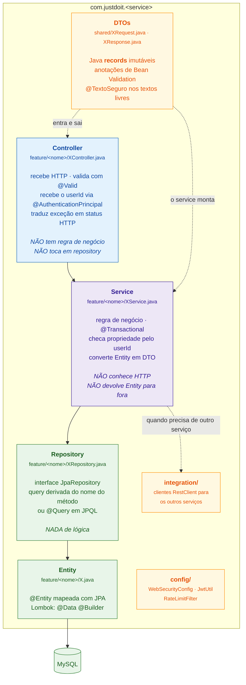
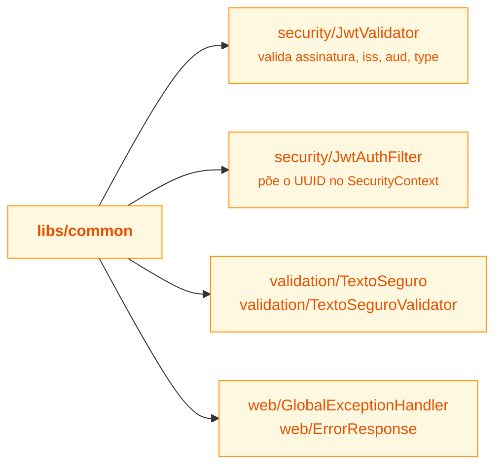
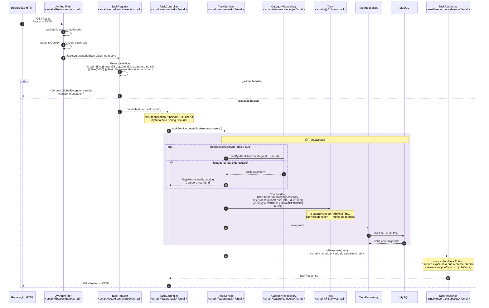
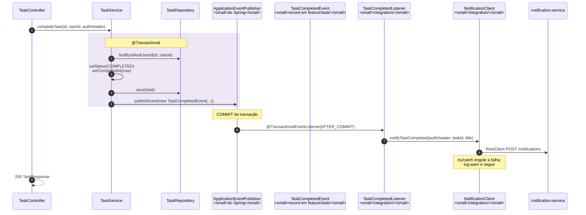
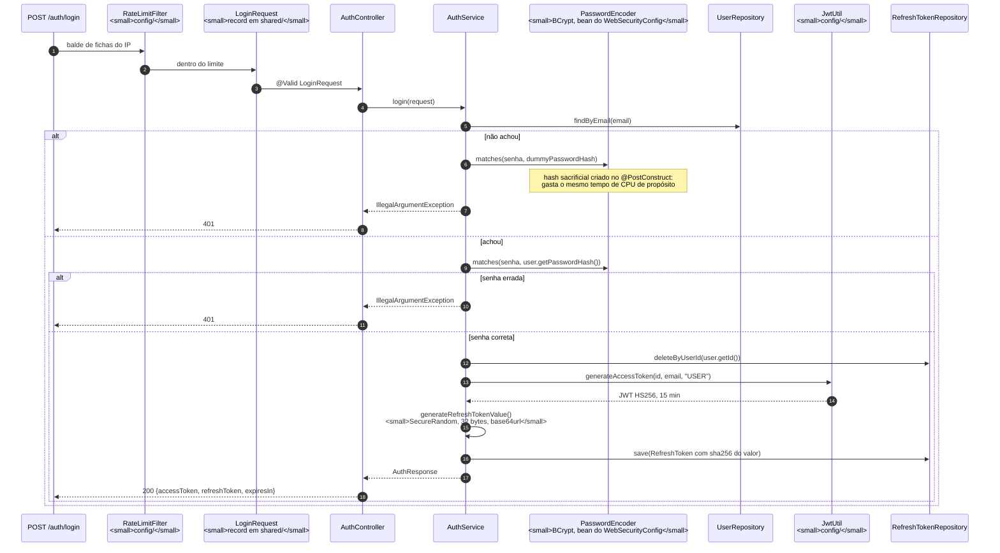
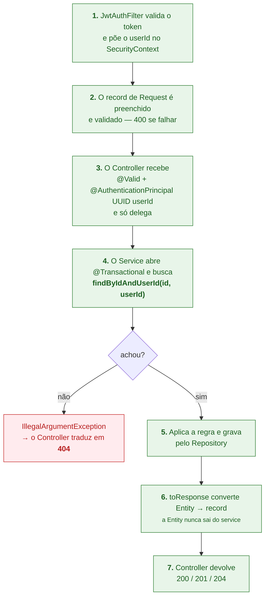

# 14. Fluxo do código — o caminho pelas camadas

Se [13-rotas.md](13-rotas.md) é o *mapa das portas*, este é o *caminho de dentro*:
que classe chama qual, com nomes reais de método, do controller até o banco.

## 14.1 As camadas e o que cada uma pode fazer

Cada serviço é organizado **por feature, não por camada**: em vez de pastas
`controllers/`, `services/`, `repositories/`, tudo que pertence a "tarefa" fica em
`feature/task/` — controller, service, repository e entity juntos. É por isso que
`feature/timer/` tem 7 arquivos e `feature/task/` tem 9: cada pasta é uma
capacidade completa.

O que é **compartilhado pelos quatro serviços** mora em `libs/common`:

## 14.2 Trilha completa — criar uma tarefa

`POST /tasks` do começo ao fim, com nome de classe e de método.

## 14.3 A mesma trilha, resumida em uma linha por camada

Este é o formato que funciona melhor para falar em voz alta:

| Camada | Classe | O que faz aqui |
|---|---|---|
| Filtro | `JwtAuthFilter` | valida o token e coloca o `UUID` no `SecurityContext` |
| DTO de entrada | `TaskRequest` (record) | Jackson preenche, Bean Validation aprova ou rejeita |
| Controller | `TaskController.createTask` | recebe `@Valid` + `@AuthenticationPrincipal`, delega |
| Service | `TaskService.createTask` | abre transação, valida a categoria, monta a `Task` |
| Entity | `Task` | objeto mapeado com JPA |
| Repository | `TaskRepository.save` | Spring Data gera o `INSERT` |
| DTO de saída | `TaskResponse` (record) | `toResponse` converte Entity → record |
| Controller | `TaskController` | devolve `201` |

## 14.4 Trilha com integração — concluir tarefa

O mesmo caminho, mais um salto entre serviços. O que muda: aparece um **evento de
domínio** e um **cliente HTTP**.

**Por que um evento em vez de chamar o client direto do service.** Chamando
direto, o `TaskService` passaria a conhecer o notification-service e a chamada HTTP
aconteceria **dentro** da transação. Com o evento, o service só anuncia "a tarefa
foi concluída" e quem escuta está em `integration/` — a camada de negócio fica sem
dependência de rede, e o `AFTER_COMMIT` garante que a notificação só sai se o
commit acontecer.

## 14.5 Trilha de autenticação — login

O login é o único fluxo onde o service faz criptografia em vez de só orquestrar.

## 14.6 O padrão que se repete em TODA operação

Se a professora perguntar "e como funciona a rota X?", a resposta é sempre esta
forma — só mudam os nomes:

As três invariantes que sustentam a segurança do sistema, e que valem repetir:

1. **O `userId` sempre vem do token**, nunca de parâmetro, query ou corpo. Não
   existe onde escrever o id de outra pessoa.
2. **Toda busca é `findByIdAndUserId`**, nunca `findById` puro. O corte de
   propriedade está na query, não num `if` depois.
3. **A Entity nunca atravessa a fronteira do service.** Sai sempre um `record` de
   Response, montado por um `toResponse` privado.

## 14.7 Onde estão as exceções a esse padrão

Honestidade sobre o que não segue a forma acima:

| Caso | Por que difere |
|---|---|
| `NotificationService.markAsRead` | usa `findById(...).filter(n -> n.getUserId().equals(userId))` em vez de query composta — mesmo efeito, checagem em memória |
| `TaskTimerService.start` | a garantia é o **índice único no banco**, não a query; o `if` prévio é só atalho ([06](06-cronometro.md)) |
| `TaskTimerService.somarSegundos` | `UPDATE ... += n` direto, sem carregar a entidade — precisa ser atômico |
| `PinnedNoteCompatController` | rota `/me/note` mantida por compatibilidade com o frontend; delega para a mesma `NoteService` |
| `UserNoteMigrationRunner` | roda no boot, migra `user_note` → `note`; idempotente. Não é request |
| Jobs `@Scheduled` | entram pelo service sem controller e sem usuário ([09](09-jobs-agendados.md)) |
