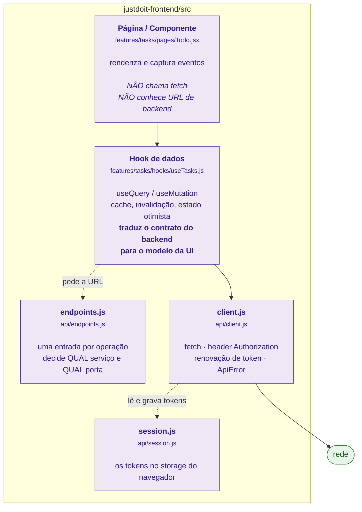
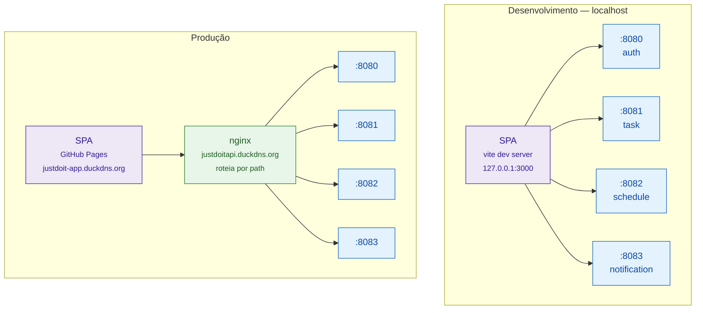
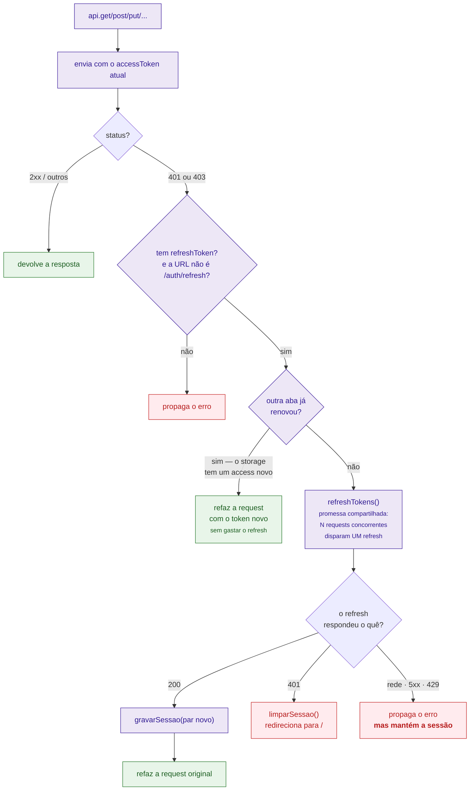
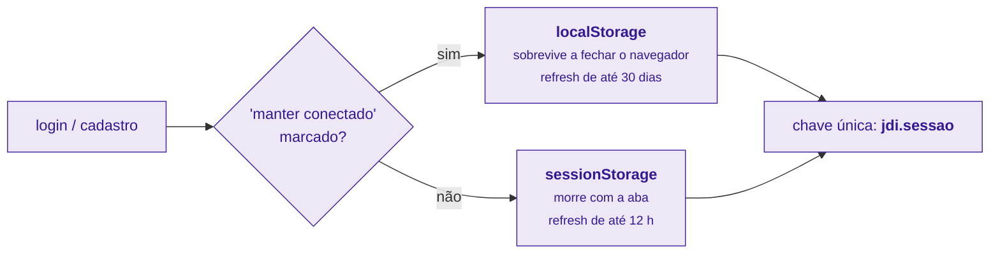
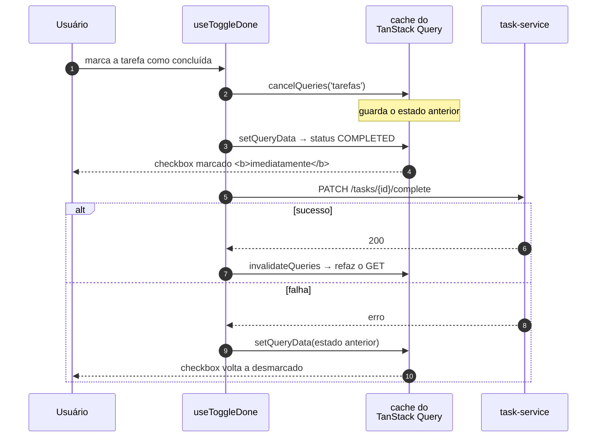
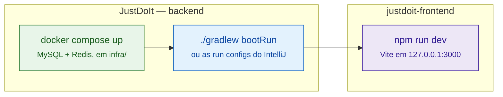

# 15. Fluxo do frontend — do clique até o `fetch`

Os diagramas 03 e 14 tratam o frontend como um participante único chamado
"Frontend" e começam a contar a história no momento em que a request chega ao
nginx. Este arquivo cobre a metade que falta: **o que acontece antes** — que
camadas o clique atravessa dentro do navegador, quem monta a URL, quem põe o
token e o que acontece quando ele expira no meio do caminho.

O frontend é uma SPA em **React 18 + Vite + TanStack Query**, e vive em um
repositório separado do backend:

| Repositório | Conteúdo |
|---|---|
| `vsProjects/JustDoIt` | os 4 serviços, `libs/common`, `infra/`, estes documentos |
| `vsProjects/justdoit-frontend` | a SPA React publicada no GitHub Pages |

## 15.1 As camadas dentro do navegador



A regra que sustenta essa separação: **componente nenhum chama `fetch`**. Se um
`.jsx` precisa de dados, ele usa um hook; o hook usa `api`; `api` é a única coisa
no projeto que conhece `fetch`. É o que permite que a renovação de token, escrita
uma vez em `client.js`, valha para todas as telas sem que nenhuma delas saiba
que ela existe.

A organização é **por feature**, igual à do backend: `features/tasks/` tem
`pages/`, `components/`, `hooks/` e `lib/` próprios, em vez de pastas globais
`components/` e `hooks/`. O alias `@` (configurado no `vite.config.js`) aponta
para `src/`, então um import entre features é `@/features/categories/hooks/...` e
não `../../../`.

## 15.2 Para onde a request vai — dev e produção são diferentes

Este é o ponto que mais confunde quem olha o código pela primeira vez: em
desenvolvimento o navegador fala com **quatro** origens diferentes; em produção,
com **uma** só.



Quem decide é o topo do `api/endpoints.js`:

```js
const isDev = location.hostname === 'localhost' || location.hostname === '127.0.0.1';

export const SVC = isDev
  ? { auth: 'http://localhost:8080', tasks: 'http://localhost:8081', ... }
  : { auth: PROD_API, tasks: PROD_API, sched: PROD_API, notif: PROD_API };
```

Em produção os quatro apontam para a **mesma** URL, e quem separa é o `location`
do nginx pelo prefixo do path (`/auth`, `/tasks`, `/time-blocks`, `/notifications`
— ver [12-topologia-deploy.md](12-topologia-deploy.md)). Consequência prática: o
frontend **não sabe** que existem quatro serviços em produção. Se amanhã dois
forem fundidos, só o `nginx.conf` muda.

Duas amarrações de porta que não são arbitrárias e vale saber por quê:

- **A porta 3000 é fixa** (`strictPort: true` no `vite.config.js`). O CORS dos
  serviços libera exatamente `http://localhost:3000`; subir em 3001 faria toda
  request ser bloqueada pelo navegador — falhar no boot é mais honesto.
- **O bind é `127.0.0.1`, não `localhost`**. Sem isso o Vite escuta só em `[::1]`
  enquanto o Chrome resolve `localhost` para `127.0.0.1`: o terminal mostra a URL,
  mas o navegador dá `ECONNREFUSED`. O `Origin` enviado continua sendo
  `http://localhost:3000`, então o CORS não se altera.

## 15.3 Trilha completa — criar uma tarefa, do clique ao `INSERT`

Esta é a resposta longa para "explica o fluxo front → api → back → banco". A
parte roxa é o navegador; a azul é o que os diagramas [03](03-request-autenticada.md)
e [14](14-fluxo-em-camadas.md) detalham.

```mermaid
sequenceDiagram
    autonumber
    participant U as Usuário
    participant TD as Todo.jsx<br/><small>página</small>
    participant UT as useCriarTarefa<br/><small>hook</small>
    participant EP as endpoints.js
    participant CL as client.js
    participant SE as session.js
    participant BE as task-service<br/><small>:8081</small>
    participant DB as MySQL

    U->>TD: preenche e envia o formulário
    TD->>UT: mutate(dados da UI)

    UT->>UT: tarefaParaApi(dados)
    Note over UT: titulo → title · descricao → description<br/>categoriaId "generico" → null<br/>prioridade PT → enum do backend

    UT->>EP: endpoints.tasks.create
    EP-->>UT: http://localhost:8081/tasks

    UT->>CL: api.post(url, body)
    CL->>SE: lerSessao()
    SE-->>CL: { accessToken, refreshToken }
    CL->>BE: POST /tasks<br/>Authorization: Bearer eyJ...<br/>Content-Type: application/json

    rect rgb(227, 242, 253)
    Note over BE,DB: JwtAuthFilter → Controller → Service → Repository<br/>(ver diagramas 03 e 14)
    BE->>DB: INSERT INTO task
    DB-->>BE: linha com id gerado
    end

    BE-->>CL: 201 Created + TaskResponse

    CL->>CL: tratarResposta(res)
    Note over CL: 204 → null · corpo vazio → null<br/>não-ok → lança ApiError(status, body)

    CL-->>UT: objeto TaskResponse
    UT->>UT: invalidateQueries(['tarefas'])
    Note over UT: o cache é marcado como velho;<br/>a lista refaz o GET /tasks sozinha
    UT-->>TD: re-render com a tarefa nova
    TD-->>U: tarefa aparece na lista
```

O passo que costuma passar despercebido é o **8** somado ao **17**: o hook não
insere a tarefa nova na lista à mão, ele apenas **invalida** a query `['tarefas']`.
Quem repõe os dados é o TanStack Query, refazendo o `GET /tasks`. O backend
continua sendo a única fonte da verdade — a UI nunca inventa o estado final.

E o **3** é onde vive a tradução de vocabulário: a UI fala `titulo`, `prioridade`,
`categoriaId`; o backend fala `title`, `priority`, `categoryId`. As duas funções
`tarefaDaApi` / `tarefaParaApi` são a fronteira, e existem para que renomear um
campo no backend quebre **um** arquivo, não trinta componentes.

## 15.4 Quando o access token expira no meio do uso

O access token dura 15 minutos; a sessão dura até 30 dias. Ou seja: expirar
durante o uso normal não é exceção, é rotina. O tratamento inteiro está em
`requisitar()`, dentro do `client.js`.



Três decisões desse fluxo que só fazem sentido junto com o backend
([02-autenticacao.md](02-autenticacao.md)):

**A promessa compartilhada (`let refreshing`).** Se a tela dispara seis requests
ao carregar e todas voltam 401, sem isso seriam seis chamadas a `/auth/refresh`.
Como o backend **rotaciona** o refresh token, da segunda em diante ele estaria
reapresentando um token já usado — que é exatamente o gatilho da detecção de
reuso, que revoga todas as sessões do usuário. O usuário seria deslogado por
carregar uma tela.

**A checagem de "outra aba já renovou".** Mesmo problema, entre abas em vez de
dentro da mesma. Se o `accessToken` no storage já é diferente do que esta request
usou, alguém renovou enquanto ela estava em voo: basta reenviar com o token novo.

**Só o 401 desloga.** Erro de rede, 5xx e 429 são passageiros — deslogar neles
derrubava o usuário a cada instabilidade do servidor. A sessão só termina quando
o servidor afirma que o refresh token não vale mais.

Nem toda falha, aliás, é falha: `getOuNull()` trata **404 como "ainda não
existe"**. Configuração de módulo, nota e cronômetro respondem 404 até o primeiro
`PUT`, e isso é estado normal, não erro.

## 15.5 Onde a sessão mora



O checkbox não é enfeite de UI: ele viaja no `LoginRequest` como `rememberMe` e
decide o prazo do refresh token **no servidor** (12 h contra 30 dias), além de
escolher o storage no cliente. Os dois lados combinam.

Três cuidados que o `session.js` toma e que valem citar:

- **`localStorage` tem prioridade na leitura**, então trocar de storage exige
  apagar o anterior — senão as duas cópias coexistem e a leitura devolve a errada.
- **Login não herda nada da sessão anterior.** Sem isso o nome do usuário anterior
  sobrevive até o `GET /auth/me` responder, e a tela pisca o nome errado.
- **Todo acesso vai em `try/catch`**: em modo privado, ou com cookies
  desabilitados, o storage lança em vez de devolver `null`.

E a afirmação que resume o desenho todo: **os tokens são o único estado de
negócio no navegador**. Tarefa, subtarefa, nota, categoria, cronômetro — nada
disso é persistido no cliente. Se o storage for apagado, o usuário só precisa
entrar de novo; nenhum dado se perde.

## 15.6 Atualização otimista — a exceção ao "espere o servidor"

Concluir uma tarefa e apagar uma tarefa não esperam a resposta: a UI muda na
hora e desfaz se o backend recusar. É o único lugar onde o cliente exibe um
estado que o servidor ainda não confirmou.



O `onSettled` invalida a query nos **dois** casos. No sucesso isso importa porque
concluir uma tarefa tem efeitos que a UI não simulou: recorrência pode gerar a
próxima ocorrência ([07](07-recorrencia.md)) e uma notificação é disparada
([05](05-ciclo-de-vida-tarefa.md)). O estado otimista é um palpite sobre o
checkbox, não sobre o sistema.

## 15.7 O que o frontend deliberadamente não faz

| Não faz | Porque |
|---|---|
| Não decide o que o usuário pode ver | o corte é `findByIdAndUserId` no backend; esconder um botão não é controle de acesso |
| Não manda `userId` em lugar nenhum | ele vem do claim `sub` do token — não há onde escrever o id de outra pessoa |
| Não valida como se fosse suficiente | a validação da UI é conveniência; a que vale é `@Valid` + `@TextoSeguro` ([11](11-validacao-de-entrada.md)) |
| Não guarda dado de negócio | só tokens; o resto é sempre buscado |
| Não sabe quantos serviços existem | em produção enxerga uma URL só, e o nginx roteia |

## 15.8 Como rodar as duas metades



A ordem importa: sem MySQL no ar os serviços não sobem, e sem os serviços a SPA
carrega mas toda tela fica em erro. Os testes do frontend rodam com
`npm test` (Vitest + Testing Library, configurados no próprio `vite.config.js`).
